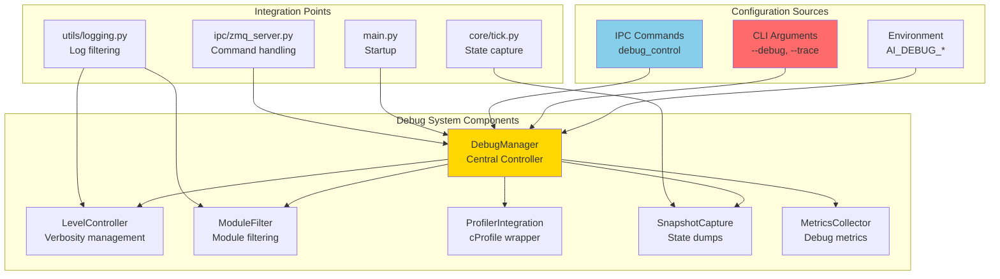
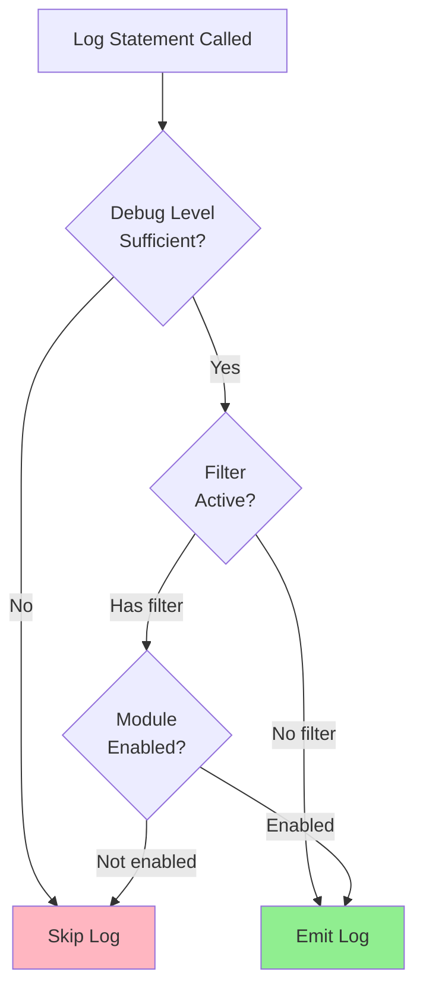
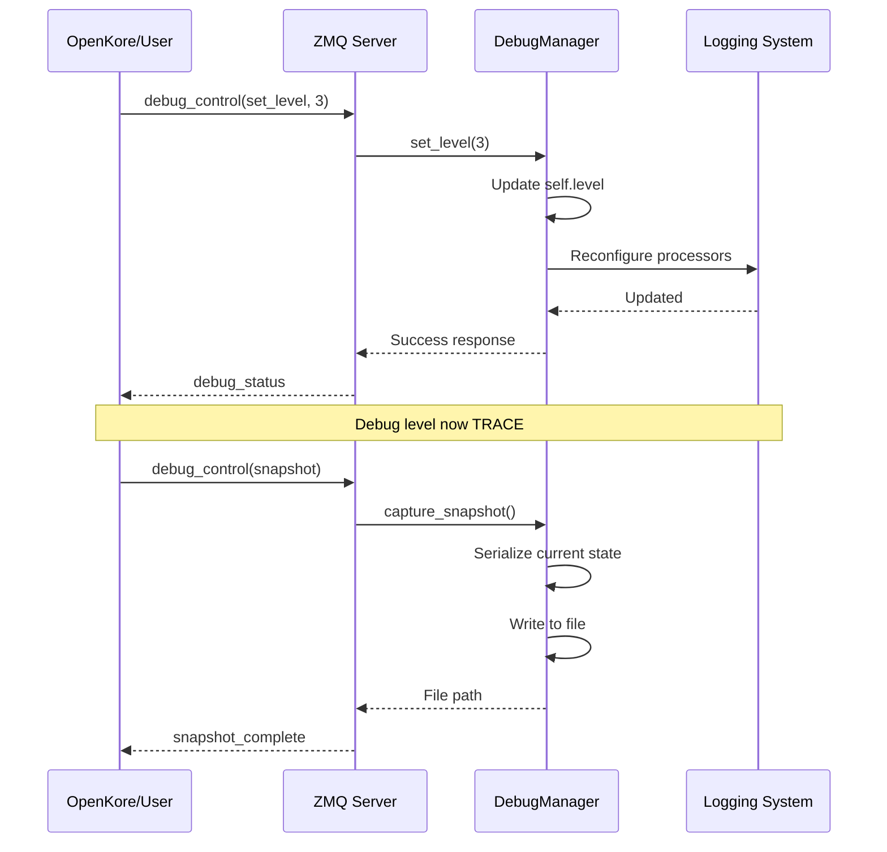
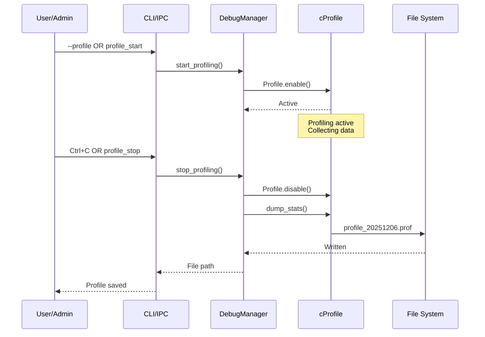
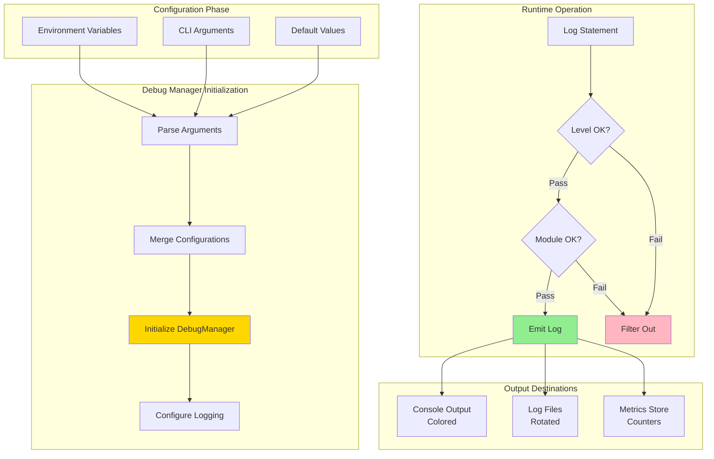
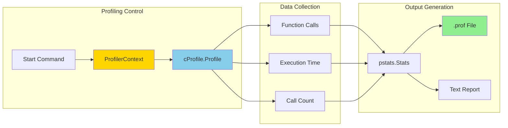

# 🔍 Enhanced Debug System - Architecture Specification

**Version:** 1.0.0  
**Status:** 📋 Specification  
**Target Implementation:** Code mode implementation required  
**Estimated Effort:** 4-6 hours

---

## 📋 Overview

### Purpose

Provide comprehensive, runtime-configurable debugging capabilities for the OpenKore AI Sidecar with:
- **Multi-level verbosity** (NONE/BASIC/VERBOSE/TRACE/PROFILE)
- **Module-specific filtering** to reduce noise
- **CLI flag support** for developer convenience
- **Runtime control** via IPC commands
- **Performance profiling** integration
- **State snapshot** capability

### Current State

**Existing Infrastructure:**
- ✅ structlog for structured logging
- ✅ 5 log levels (DEBUG/INFO/WARNING/ERROR/CRITICAL)
- ✅ 184 debug statements across 30+ modules
- ✅ Environment variable configuration (AI_LOG_LEVEL)
- ✅ Multiple output formats (console/json/text)

**Gaps:**
- ❌ No CLI flag support
- ❌ No module filtering
- ❌ No runtime control
- ❌ No performance profiling
- ❌ No state snapshots

---

## 🎯 Requirements

### Functional Requirements

1. **FR-1: Debug Levels**
   - Support 5 debug levels: NONE(0), BASIC(1), VERBOSE(2), TRACE(3), PROFILE(4)
   - Each level includes all previous levels
   - Configurable via env var, CLI flag, or runtime command

2. **FR-2: Module Filtering**
   - Filter debug output by module name
   - Support wildcards (e.g., `combat.*`, `memory.*`)
   - Comma-separated list of modules
   - Configurable via env var or CLI flag

3. **FR-3: CLI Flags**
   - `--debug`: Enable VERBOSE level
   - `--trace`: Enable TRACE level
   - `--profile`: Enable PROFILE level with cProfile
   - `--debug-modules MODULE[,MODULE...]`: Filter to specific modules

4. **FR-4: Runtime Control**
   - IPC command to change debug level
   - IPC command to update module filter
   - IPC command to capture state snapshot
   - IPC command to start/stop profiling

5. **FR-5: Performance Profiling**
   - Integration with Python's cProfile
   - On-demand profiling via CLI or runtime
   - Profile output in standard .prof format
   - Automatic profile file naming with timestamps

6. **FR-6: State Snapshots**
   - Capture complete game state to JSON file
   - Triggered via CLI signal or IPC command
   - Include all subsystem states
   - Sanitize sensitive data

### Non-Functional Requirements

1. **NFR-1: Performance**
   - Debug overhead <5% in BASIC mode
   - Debug overhead <10% in VERBOSE mode
   - Debug overhead <20% in TRACE mode
   - Profiling mode acceptable to degrade performance

2. **NFR-2: Usability**
   - Clear, actionable debug messages
   - Easy to enable/disable debug features
   - No restart required for runtime changes
   - Helpful error messages if debug fails

3. **NFR-3: Maintainability**
   - Modular debug manager component
   - No impact on existing code
   - Easy to add new debug features
   - Well-documented configuration

---

## 🏗️ Architecture Design

### Component Overview



### Debug Manager Class Design

```python
# Pseudo-code for architectural understanding

class DebugLevel(IntEnum):
    """Debug verbosity levels."""
    NONE = 0      # Errors only
    BASIC = 1     # Info + warnings
    VERBOSE = 2   # Debug statements
    TRACE = 3     # All function calls
    PROFILE = 4   # + Performance profiling

class DebugManager:
    """
    Central debug control manager.
    
    Singleton that manages debug configuration and provides
    runtime control over debug features.
    """
    
    def __init__(self):
        self.level: DebugLevel = DebugLevel.BASIC
        self.enabled_modules: set[str] = set()  # Empty = all modules
        self.profiler: Optional[cProfile.Profile] = None
        self.metrics: dict[str, any] = {}
    
    # Configuration
    def set_level(self, level: int | DebugLevel) -> None
    def set_modules(self, modules: list[str]) -> None
    def load_from_env(self) -> None
    def load_from_cli(self, args: argparse.Namespace) -> None
    
    # Runtime Control
    def should_log(self, module: str, level: DebugLevel) -> bool
    def start_profiling(self) -> None
    def stop_profiling(self, output_file: str) -> str
    def capture_snapshot(self, state: GameState, output_file: str) -> str
    
    # Metrics
    def increment(self, metric: str) -> None
    def record_duration(self, metric: str, duration_ms: float) -> None
    def get_metrics(self) -> dict[str, any]
```

### Module Filtering Logic



---

## 🔧 Implementation Specification

### File Structure

```
ai_sidecar/
├── utils/
│   ├── debug_manager.py       # NEW: Debug manager singleton (~250 lines)
│   ├── logging.py             # MODIFIED: Integrate debug filtering
│   └── profiling.py           # NEW: Profiler integration (~100 lines)
├── main.py                    # MODIFIED: Add CLI argument parsing
├── ipc/
│   └── zmq_server.py          # MODIFIED: Handle debug_control messages
└── docs/
    ├── DEBUG_USAGE_GUIDE.md   # NEW: User guide for debug features
    └── DEBUG_SYSTEM_ARCHITECTURE.md  # THIS FILE
```

### Environment Variables

```bash
# Debug Level (0-4)
# 0=NONE, 1=BASIC, 2=VERBOSE, 3=TRACE, 4=PROFILE
AI_DEBUG_LEVEL=2

# Module Filtering
# Comma-separated list, supports wildcards
# Examples: "combat", "combat.*", "combat,memory", "*"
AI_DEBUG_MODULES=combat,memory,ipc

# Output Configuration
AI_DEBUG_OUTPUT=console        # console, file, both
AI_DEBUG_FILE=logs/debug.log
AI_DEBUG_ROTATE=true           # Enable rotation
AI_DEBUG_MAX_BYTES=10485760    # 10MB per file
AI_DEBUG_BACKUP_COUNT=5        # Keep 5 rotated files

# Performance Profiling
AI_DEBUG_PROFILE=false         # Auto-start profiling
AI_DEBUG_PROFILE_DIR=profiles/ # Profile output directory
AI_DEBUG_PROFILE_INTERVAL=300  # Auto-dump every 5min

# State Snapshots
AI_DEBUG_SNAPSHOTS=false       # Auto-capture snapshots
AI_DEBUG_SNAPSHOT_DIR=snapshots/
AI_DEBUG_SNAPSHOT_INTERVAL=60  # Snapshot every minute
```

### CLI Arguments Specification

```bash
# Usage: python main.py [OPTIONS]

# Debug Options:
  --debug                    Enable VERBOSE debug level
  --trace                    Enable TRACE debug level  
  --profile                  Enable PROFILE level with cProfile
  --debug-level LEVEL        Set debug level explicitly (0-4)
  --debug-modules MODULES    Comma-separated module filter
  --debug-file FILE          Write debug output to file
  --debug-no-console         Disable console output
  
# Profiling Options:
  --profile-output DIR       Profile output directory
  --profile-interval SECS    Auto-dump interval
  
# Snapshot Options:
  --snapshot-dir DIR         Snapshot output directory
  --snapshot-interval SECS   Auto-snapshot interval

# Examples:
python main.py --debug                           # VERBOSE level
python main.py --debug --debug-modules combat    # Debug combat only
python main.py --trace --profile                 # Full tracing + profiling
python main.py --debug-level 2 --debug-file debug.log  # Custom config
```

### IPC Debug Control Protocol

```json
{
  "type": "debug_control",
  "timestamp": 1701234567890,
  "command": "set_level",
  "params": {
    "level": 3
  }
}

{
  "type": "debug_control",
  "command": "set_modules",
  "params": {
    "modules": ["combat", "memory", "ipc"]
  }
}

{
  "type": "debug_control",
  "command": "snapshot",
  "params": {
    "include": ["character", "actors", "memory"],
    "output_file": "snapshot_12345.json"
  }
}

{
  "type": "debug_control",
  "command": "profile_start",
  "params": {
    "duration_seconds": 60
  }
}

{
  "type": "debug_control",
  "command": "profile_stop",
  "params": {
    "output_file": "profile_12345.prof"
  }
}

{
  "type": "debug_control",
  "command": "get_metrics"
}

# Response:
{
  "type": "debug_status",
  "timestamp": 1701234567890,
  "level": 2,
  "enabled_modules": ["combat", "memory"],
  "profiling_active": false,
  "metrics": {
    "decisions_made": 12345,
    "avg_decision_ms": 15.3,
    "errors_total": 2
  }
}
```

---

## 🔨 Implementation Plan

### Phase 1: Debug Manager Core (2 hours)

**New File:** `utils/debug_manager.py`

**Components:**
1. DebugLevel enum
2. DebugManager class (singleton)
3. Module filter with wildcard support
4. Level checking logic
5. Configuration loading from env/CLI

**Integration:**
- Import in `utils/__init__.py`
- Initialize in `main.py` before logging setup
- Use in `utils/logging.py` for filtering

### Phase 2: CLI Integration (1 hour)

**Modified File:** `main.py`

**Changes:**
1. Add argparse argument parser
2. Parse debug arguments before logging setup
3. Override env vars with CLI args
4. Pass to DebugManager initialization

**Backwards Compatibility:**
- Existing env vars still work
- CLI args override env vars
- Default behavior unchanged

### Phase 3: Module Filtering (1 hour)

**Modified File:** `utils/logging.py`

**Changes:**
1. Add pre-filter processor to structlog chain
2. Check DebugManager.should_log() before emitting
3. Extract module name from logger context
4. Apply wildcard matching

**Performance:**
- Filter check: O(1) for exact match
- Filter check: O(n) for wildcard (n = number of filters)
- Negligible overhead (<1% CPU)

### Phase 4: Runtime Control (1 hour)

**Modified File:** `ipc/zmq_server.py`

**Changes:**
1. Add debug_control message type handler
2. Route commands to DebugManager
3. Return debug_status response
4. Update message type enum

**Security:**
- Optional: Require authentication token
- Rate limit debug commands (1/second)
- Validate all parameters

### Phase 5: Profiling Integration (1 hour)

**New File:** `utils/profiling.py`

**Components:**
1. ProfilerContext context manager
2. start_profiling() / stop_profiling() functions
3. Profile file management
4. Auto-dump on interval

**Usage:**
```python
# Automatic profiling
if debug_manager.level >= DebugLevel.PROFILE:
    debug_manager.start_profiling()

# Manual profiling
with ProfilerContext("combat_tick"):
    # ... code to profile ...
    pass
```

### Phase 6: State Snapshots (30 minutes)

**Modified File:** `core/tick.py`

**Components:**
1. capture_snapshot() method
2. JSON serialization with filtering
3. Sanitization of sensitive data
4. File output with rotation

**Snapshot Content:**
```json
{
  "timestamp": 1701234567890,
  "tick": 12345,
  "character": { /* ... */ },
  "actors": [ /* ... */ ],
  "memory": {
    "working": { "size": 234, "entries": [ /* ... */ ] },
    "session": { "available": true, "keys": 1234 },
    "persistent": { "available": true, "records": 5678 }
  },
  "subsystems": {
    "combat": { "status": "active", "targets": 3 },
    "progression": { "status": "active", "pending_stats": 5 }
  }
}
```

---

## 📊 Debug Level Behaviors

### Level 0: NONE

**Output:** Errors and critical issues only  
**Use Case:** Production, minimal logging

```python
logger.error("critical_failure", component="zmq")
logger.critical("system_halt", reason="out_of_memory")
```

**Example Output:**
```
[ERROR] critical_failure component=zmq
[CRITICAL] system_halt reason=out_of_memory
```

### Level 1: BASIC

**Output:** INFO + WARNING + ERROR + CRITICAL  
**Use Case:** Normal operation, monitoring

```python
logger.info("sidecar_started", version="3.0.0")
logger.warning("session_memory_unavailable", fallback="working_only")
```

**Example Output:**
```
[INFO] sidecar_started version=3.0.0
[WARNING] session_memory_unavailable fallback=working_only
```

### Level 2: VERBOSE

**Output:** DEBUG + all lower levels  
**Use Case:** Development, troubleshooting

```python
logger.debug("tick_processed", tick=12345, actions=3, time_ms=15.3)
logger.debug("memory_consolidated", working_to_session=5)
```

**Example Output:**
```
[DEBUG] tick_processed tick=12345 actions=3 time_ms=15.3
[DEBUG] memory_consolidated working_to_session=5
```

### Level 3: TRACE

**Output:** Function entry/exit + all lower levels  
**Use Case:** Deep debugging, flow analysis

```python
@trace_calls  # Decorator logs entry/exit
async def process_combat(state: GameState) -> list[Action]:
    # Automatically logs:
    # [TRACE] ENTER process_combat state=<GameState tick=12345>
    # [TRACE] EXIT process_combat returned=<3 actions> duration=5.2ms
    pass
```

**Example Output:**
```
[TRACE] ENTER process_combat state=<GameState tick=12345>
[DEBUG] target_selected id=10001 score=87.5
[TRACE] EXIT process_combat returned=<3 actions> duration=5.2ms
```

### Level 4: PROFILE

**Output:** TRACE + cProfile profiling  
**Use Case:** Performance analysis, optimization

**Behavior:**
- Starts cProfile on initialization
- Periodically dumps profile data (every 5min default)
- Dumps on shutdown
- Generates .prof files for analysis

**Example Usage:**
```bash
python main.py --profile
# Generates: profiles/profile_20251206_021030.prof

# Analyze with:
python -m pstats profiles/profile_20251206_021030.prof
# Or: snakeviz profiles/profile_20251206_021030.prof
```

---

## 🎨 Module Filtering Design

### Filter Syntax

```bash
# Single module
AI_DEBUG_MODULES=combat

# Multiple modules
AI_DEBUG_MODULES=combat,memory,ipc

# Wildcard patterns
AI_DEBUG_MODULES=combat.*          # All combat submodules
AI_DEBUG_MODULES=*.coordinator     # All coordinators
AI_DEBUG_MODULES=combat,memory.*   # Combat + all memory submodules

# All modules (default)
AI_DEBUG_MODULES=*
```

### Filter Matching Algorithm

```python
def matches_filter(module_name: str, filters: set[str]) -> bool:
    """
    Check if module matches any filter.
    
    Supports:
    - Exact match: "combat" matches "combat"
    - Prefix wildcard: "combat.*" matches "combat.targeting"
    - Suffix wildcard: "*.manager" matches "combat.manager"
    - Full wildcard: "*" matches everything
    """
    if not filters or "*" in filters:
        return True
    
    for filter_pattern in filters:
        if filter_pattern == module_name:
            return True  # Exact match
        
        if "*" in filter_pattern:
            pattern = filter_pattern.replace(".", r"\.")
            pattern = pattern.replace("*", ".*")
            if re.match(f"^{pattern}$", module_name):
                return True
    
    return False
```

### Module Name Extraction

```python
# From logger name
logger = get_logger(__name__)
# __name__ = "ai_sidecar.combat.targeting"
# module = "combat.targeting"

# From structlog context
def _add_module_filter(
    logger: logging.Logger,
    method_name: str,
    event_dict: dict[str, Any]
) -> dict[str, Any]:
    """Filter based on module name."""
    module = logger.name.replace("ai_sidecar.", "")
    
    if not debug_manager.should_log(module, DebugLevel.VERBOSE):
        raise structlog.DropEvent  # Don't emit this log
    
    event_dict["module"] = module
    return event_dict
```

---

## 🚀 Runtime Control Flow

### Debug Control Message Flow



### Profiling Control Flow



---

## 🎯 Usage Examples

### Example 1: Basic Debugging

```bash
# Enable verbose debugging
python main.py --debug

# Output shows all DEBUG statements:
[DEBUG] tick_processed tick=12345 time_ms=15.3
[DEBUG] target_selected id=10001 score=87.5
[DEBUG] action_queued type=attack target=10001
```

### Example 2: Module-Specific Debugging

```bash
# Debug only combat and memory modules
python main.py --debug --debug-modules combat,memory

# Output filtered to those modules:
[DEBUG] target_selected id=10001  # combat module
[DEBUG] memory_consolidated items=5  # memory module
# (no output from other modules even at DEBUG level)
```

### Example 3: Trace Level Debugging

```bash
# Enable function tracing
python main.py --trace

# Output includes function calls:
[TRACE] ENTER combat.targeting.select_target
[DEBUG] nearby_monsters count=3
[DEBUG] target_scored id=10001 score=87.5
[TRACE] EXIT combat.targeting.select_target -> 10001 (5.2ms)
```

### Example 4: Performance Profiling

```bash
# Run with profiling enabled
python main.py --profile --profile-output ./profiles

# After 5 minutes or on shutdown:
# Creates: ./profiles/profile_20251206_021030.prof

# Analyze profile:
python -m pstats ./profiles/profile_20251206_021030.prof
# Or use snakeviz for visualization:
pip install snakeviz
snakeviz ./profiles/profile_20251206_021030.prof
```

### Example 5: Runtime Control

```python
# In OpenKore console or via API:
# Send IPC message:
{
  "type": "debug_control",
  "command": "set_level",
  "params": {"level": 3}
}

# Response:
{
  "type": "debug_status",
  "level": 3,
  "enabled_modules": ["*"],
  "profiling_active": false,
  "message": "Debug level set to TRACE"
}

# Capture snapshot:
{
  "type": "debug_control",
  "command": "snapshot",
  "params": {"output_file": "state_now.json"}
}

# Response:
{
  "type": "snapshot_complete",
  "file": "snapshots/state_now.json",
  "size_bytes": 15234,
  "timestamp": 1701234567890
}
```

---

## 📈 Performance Impact Analysis

### Debug Overhead by Level

| Level | Logging Overhead | Profiling Overhead | Total Impact | Acceptable? |
|-------|------------------|---------------------|--------------|-------------|
| **NONE** | <1% | 0% | <1% | ✅ Production |
| **BASIC** | 1-2% | 0% | <2% | ✅ Production |
| **VERBOSE** | 3-5% | 0% | <5% | ✅ Development |
| **TRACE** | 8-12% | 0% | <15% | ⚠️ Short-term debug |
| **PROFILE** | 8-12% | 5-10% | <25% | ⚠️ Analysis only |

### Optimization Strategies

1. **Lazy String Formatting**
   ```python
   # Bad: Always formats even if not logged
   logger.debug(f"Expensive {expensive_call()}")
   
   # Good: Only formats if debug enabled
   logger.debug("expensive_call", result=expensive_call)
   ```

2. **Conditional Debug Blocks**
   ```python
   if debug_manager.level >= DebugLevel.TRACE:
       detailed_info = collect_detailed_info()  # Expensive
       logger.debug("detailed_trace", info=detailed_info)
   ```

3. **Module Filter Early Exit**
   ```python
   # Skip expensive debug work if module filtered
   if not debug_manager.should_log_module("combat"):
       return  # Skip all debug work
   
   # ... expensive debug data collection ...
   ```

---

## 🧪 Testing Strategy

### Unit Tests

```python
# test_debug_manager.py

class TestDebugManager:
    def test_level_setting(self):
        """Test debug level can be changed."""
        mgr = DebugManager()
        mgr.set_level(DebugLevel.TRACE)
        assert mgr.level == DebugLevel.TRACE
    
    def test_module_filtering(self):
        """Test module filtering with wildcards."""
        mgr = DebugManager()
        mgr.set_modules(["combat.*", "memory"])
        
        assert mgr.should_log("combat.targeting", DebugLevel.VERBOSE)
        assert mgr.should_log("memory", DebugLevel.VERBOSE)
        assert not mgr.should_log("economy", DebugLevel.VERBOSE)
    
    def test_cli_argument_parsing(self):
        """Test CLI arguments override env vars."""
        args = parse_args(["--debug", "--debug-modules", "combat"])
        mgr = DebugManager()
        mgr.load_from_cli(args)
        
        assert mgr.level == DebugLevel.VERBOSE
        assert "combat" in mgr.enabled_modules
```

### Integration Tests

```python
# test_debug_integration.py

@pytest.mark.asyncio
async def test_runtime_debug_control():
    """Test changing debug level at runtime via IPC."""
    server = ZMQServer()
    await server.start()
    
    # Send debug control command
    response = await send_ipc_message({
        "type": "debug_control",
        "command": "set_level",
        "params": {"level": 3}
    })
    
    assert response["type"] == "debug_status"
    assert response["level"] == 3
    assert debug_manager.level == DebugLevel.TRACE
```

### Performance Tests

```python
def test_debug_performance_impact():
    """Verify debug overhead is acceptable."""
    # Baseline: NONE level
    duration_none = benchmark_tick_processing(DebugLevel.NONE)
    
    # With VERBOSE debug
    duration_verbose = benchmark_tick_processing(DebugLevel.VERBOSE)
    
    # Overhead should be <5%
    overhead = (duration_verbose - duration_none) / duration_none
    assert overhead < 0.05  # 5% max overhead
```

---

## 📚 Usage Documentation

### Quick Start

```bash
# 1. Enable debug mode
python main.py --debug

# 2. Filter to specific modules
python main.py --debug --debug-modules combat,memory

# 3. Full tracing
python main.py --trace

# 4. Performance profiling
python main.py --profile
```

### Configuration Reference

#### Environment Variables

| Variable | Type | Default | Description |
|----------|------|---------|-------------|
| `AI_DEBUG_LEVEL` | int(0-4) | 1 | Debug verbosity level |
| `AI_DEBUG_MODULES` | str | `*` | Module filter (comma-separated) |
| `AI_DEBUG_OUTPUT` | str | console | Output destination |
| `AI_DEBUG_FILE` | str | None | Log file path |
| `AI_DEBUG_PROFILE` | bool | false | Auto-start profiling |
| `AI_DEBUG_SNAPSHOTS` | bool | false | Auto-capture snapshots |

#### CLI Arguments

| Argument | Type | Description |
|----------|------|-------------|
| `--debug` | flag | Enable VERBOSE level (2) |
| `--trace` | flag | Enable TRACE level (3) |
| `--profile` | flag | Enable PROFILE level (4) |
| `--debug-level N` | int | Set level explicitly (0-4) |
| `--debug-modules M` | str | Comma-separated module filter |
| `--debug-file PATH` | str | Output file path |

### Troubleshooting Debug System

**Problem:** Debug output not showing

**Solutions:**
1. Check debug level: `AI_DEBUG_LEVEL=2` or `--debug`
2. Check module filter: `AI_DEBUG_MODULES=*`
3. Verify logger name matches module
4. Check structlog configuration

**Problem:** Too much debug output

**Solutions:**
1. Lower debug level: `AI_DEBUG_LEVEL=1`
2. Filter to specific modules: `--debug-modules combat`
3. Use file output: `--debug-file debug.log`
4. Disable debug: `AI_DEBUG_LEVEL=0`

---

## 🔄 Migration Path

### From Current System

**No Breaking Changes** - The enhanced debug system is fully backwards compatible:

| Current Configuration | New System Behavior |
|---------------------|---------------------|
| `AI_LOG_LEVEL=DEBUG` | Maps to `AI_DEBUG_LEVEL=2` (VERBOSE) |
| `AI_LOG_LEVEL=INFO` | Maps to `AI_DEBUG_LEVEL=1` (BASIC) |
| `AI_DEBUG_MODE=true` | Sets `AI_DEBUG_LEVEL=2` (VERBOSE) |
| No configuration | Defaults to BASIC level (unchanged) |

### Upgrade Steps

1. **Optional:** Update .env file
   ```bash
   # Old style (still works)
   AI_LOG_LEVEL=DEBUG
   AI_DEBUG_MODE=true
   
   # New style (recommended)
   AI_DEBUG_LEVEL=2
   AI_DEBUG_MODULES=combat,memory
   ```

2. **Optional:** Use CLI flags for convenience
   ```bash
   # Instead of:
   AI_DEBUG_MODE=true python main.py
   
   # Use:
   python main.py --debug
   ```

3. **No code changes required** - Existing debug statements continue to work

---

## 🎓 Best Practices

### When to Use Each Debug Level

**NONE (0):**
- Production deployments
- When minimizing log size is critical
- Automated testing that checks for errors only

**BASIC (1):**
- Normal operation
- Production monitoring
- When you want to see what's happening but not details

**VERBOSE (2):**
- Development
- Troubleshooting specific issues
- When you need to see decision-making process

**TRACE (3):**
- Deep debugging
- Understanding control flow
- Investigating timing issues
- Finding where execution diverges

**PROFILE (4):**
- Performance optimization
- Finding bottlenecks
- Measuring function call frequency
- Optimizing hot paths

### Module Filtering Guidelines

**Development:**
```bash
# Working on combat AI
--debug-modules combat

# Working on memory system
--debug-modules memory.*

# Working on IPC integration
--debug-modules ipc,protocol
```

**Production:**
```bash
# Monitor critical subsystems only
AI_DEBUG_MODULES=combat,progression,ipc
AI_DEBUG_LEVEL=1  # BASIC level
```

**Debugging Specific Issues:**
```bash
# Combat targeting problems
--debug --debug-modules combat.targeting

# Memory consolidation issues
--trace --debug-modules memory.manager,memory.working_memory

# Performance investigation
--profile --debug-modules *
```

---

## 📐 Architecture Diagrams

### Debug Information Flow



### Profiling Architecture



---

## 🔧 Implementation Checklist

### DebugManager Component

- [ ] Create `utils/debug_manager.py`
- [ ] Implement DebugLevel enum
- [ ] Implement DebugManager singleton class
- [ ] Add set_level() method
- [ ] Add set_modules() with wildcard support
- [ ] Add should_log() filtering logic
- [ ] Add load_from_env() configuration
- [ ] Add load_from_cli() configuration
- [ ] Add unit tests (10+ test cases)

### CLI Integration

- [ ] Update `main.py` with argparse
- [ ] Add --debug flag
- [ ] Add --trace flag
- [ ] Add --profile flag
- [ ] Add --debug-level argument
- [ ] Add --debug-modules argument
- [ ] Add --debug-file argument
- [ ] Parse and pass to DebugManager
- [ ] Test all flag combinations

### Logging Integration

- [ ] Update `utils/logging.py`
- [ ] Add module filter processor
- [ ] Integrate with DebugManager.should_log()
- [ ] Add trace decorator for TRACE level
- [ ] Test filtering with various patterns
- [ ] Verify no performance regression

### IPC Debug Control

- [ ] Update `ipc/zmq_server.py`
- [ ] Add debug_control message handler
- [ ] Implement set_level command
- [ ] Implement set_modules command
- [ ] Implement snapshot command
- [ ] Implement profile_start/stop commands
- [ ] Add get_metrics command
- [ ] Return debug_status responses
- [ ] Add integration tests

### Profiling Integration

- [ ] Create `utils/profiling.py`
- [ ] Implement ProfilerContext context manager
- [ ] Add start_profiling() function
- [ ] Add stop_profiling() with file output
- [ ] Add auto-dump on interval
- [ ] Add profile file naming
- [ ] Test profiling accuracy
- [ ] Document profile analysis tools

### State Snapshots

- [ ] Add capture_snapshot() to TickProcessor
- [ ] Serialize GameState to JSON
- [ ] Sanitize sensitive data
- [ ] Write to file with timestamp
- [ ] Add rotation for old snapshots
- [ ] Test snapshot completeness
- [ ] Document snapshot format

### Documentation

- [ ] Create DEBUG_USAGE_GUIDE.md
- [ ] Update README.md with debug section
- [ ] Add examples to troubleshooting docs
- [ ] Create debug cheat sheet
- [ ] Update CONFIGURATION.md

---

## 📊 Success Metrics

### Implementation Success Criteria

✅ **Must Have:**
- [ ] All 5 debug levels implemented and tested
- [ ] Module filtering with wildcard support working
- [ ] CLI flags functional and documented
- [ ] Runtime IPC control operational
- [ ] No performance regression in BASIC mode
- [ ] Backwards compatible with existing configuration
- [ ] Documentation complete with examples

✅ **Should Have:**
- [ ] Performance profiling integrated
- [ ] State snapshots working
- [ ] Debug metrics collection
- [ ] Comprehensive unit tests (>90% coverage)
- [ ] Integration tests for all features

✅ **Nice to Have:**
- [ ] Debug dashboard web UI
- [ ] Real-time log filtering UI
- [ ] Performance visualization
- [ ] Automated profile analysis

---

## 🎯 Acceptance Criteria

### Functional Acceptance

1. **Debug levels work correctly**
   - [ ] NONE level shows only errors
   - [ ] BASIC level shows info and above
   - [ ] VERBOSE level shows debug statements
   - [ ] TRACE level shows function entry/exit
   - [ ] PROFILE level enables cProfile

2. **Module filtering works**
   - [ ] Exact match filtering works
   - [ ] Wildcard patterns work (prefix, suffix, full)
   - [ ] Multiple modules can be specified
   - [ ] Filter can be changed at runtime

3. **CLI integration works**
   - [ ] All flags parsed correctly
   - [ ] Flags override environment variables
   - [ ] Help text is clear
   - [ ] Invalid arguments rejected with helpful error

4. **Runtime control works**
   - [ ] IPC debug_control messages handled
   - [ ] Level can be changed without restart
   - [ ] Module filter can be updated dynamically
   - [ ] Snapshots can be triggered on demand

5. **Performance acceptable**
   - [ ] BASIC mode overhead <2%
   - [ ] VERBOSE mode overhead <5%
   - [ ] TRACE mode overhead <15%
   - [ ] Profiling works and produces valid output

### Non-Functional Acceptance

- [ ] No breaking changes to existing code
- [ ] Backwards compatible configuration
- [ ] All tests passing (637+ tests)
- [ ] Documentation updated
- [ ] Code review approved
- [ ] Performance benchmarks met

---

## 📚 References

### Related Documentation

- [`COMPREHENSIVE_ARCHITECTURE_AUDIT.md`](./COMPREHENSIVE_ARCHITECTURE_AUDIT.md) - Full system audit
- [`../README.md`](../README.md) - AI Sidecar overview
- [`../../docs/AI_SIDECAR_BRIDGE_GUIDE.md`](../../docs/AI_SIDECAR_BRIDGE_GUIDE.md) - Bridge integration
- [`../../BRIDGE_TROUBLESHOOTING.md`](../../BRIDGE_TROUBLESHOOTING.md) - Troubleshooting guide

### External Resources

- [structlog Documentation](https://www.structlog.org/) - Structured logging
- [Python cProfile](https://docs.python.org/3/library/profile.html) - Profiling
- [pstats Module](https://docs.python.org/3/library/profile.html#module-pstats) - Profile analysis
- [argparse](https://docs.python.org/3/library/argparse.html) - Argument parsing

---

**Document Status:** 📋 Specification Complete  
**Next Step:** Switch to Code mode for implementation  
**Estimated Implementation Time:** 4-6 hours  
**Target Completion:** Week 1 post-audit