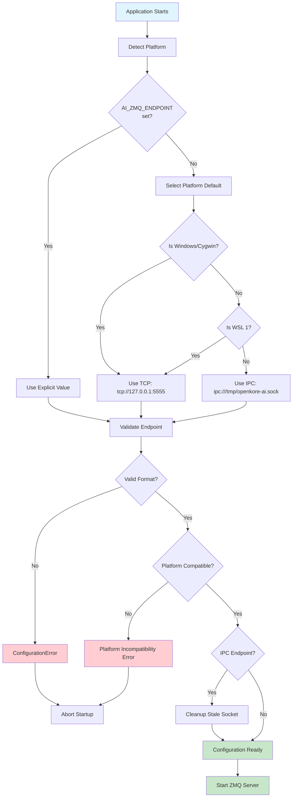
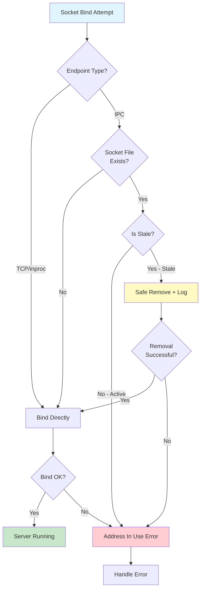
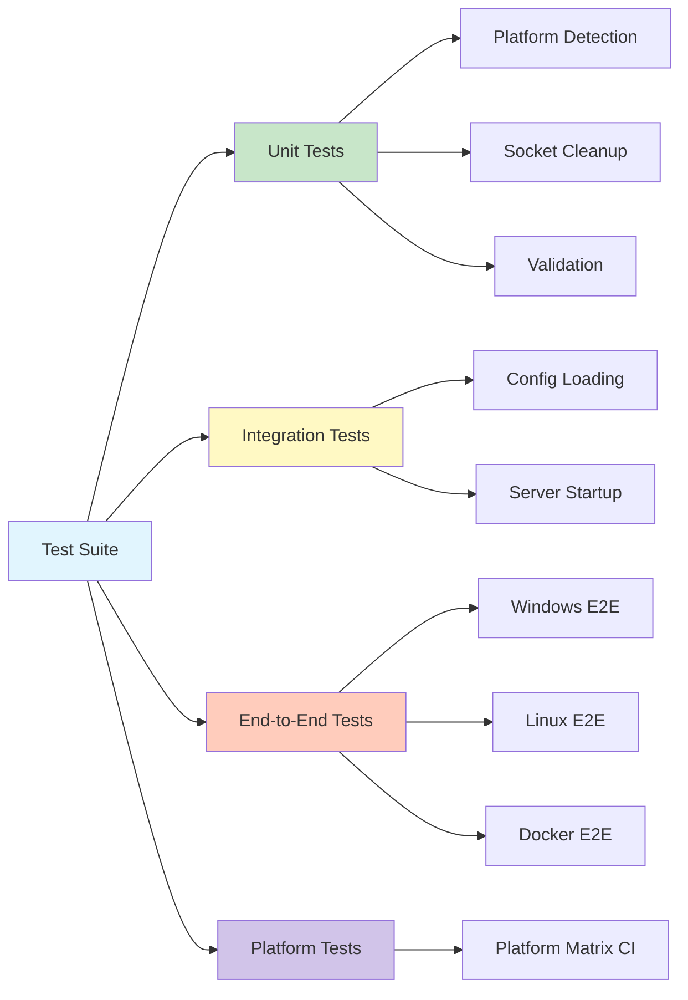
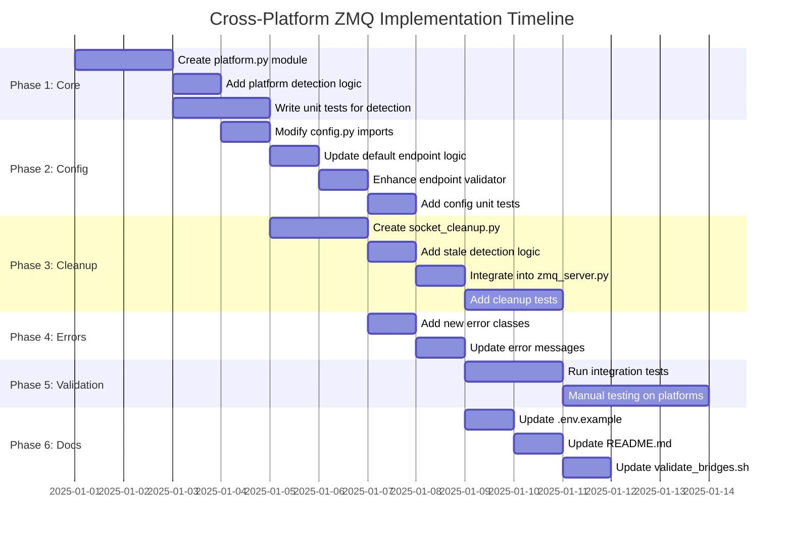
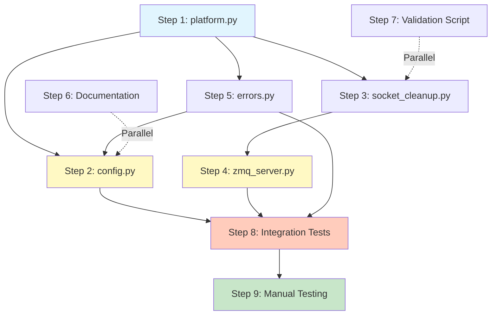
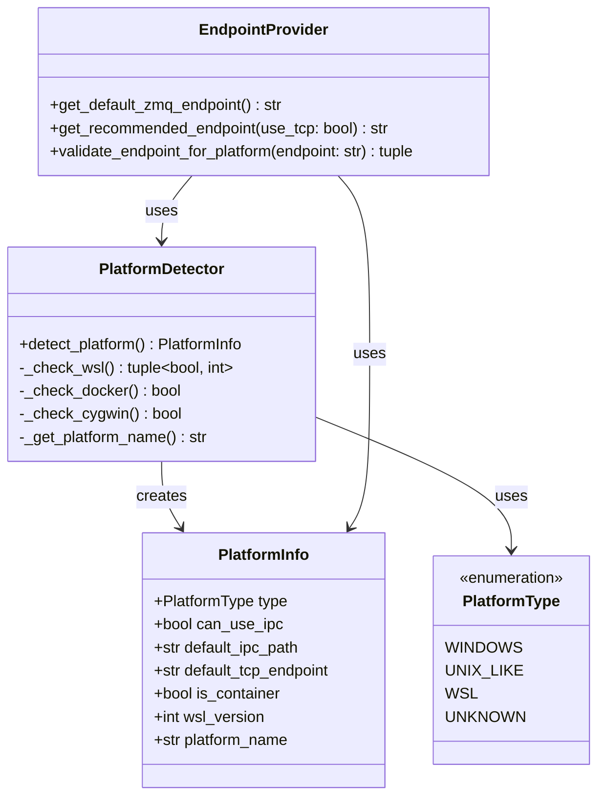
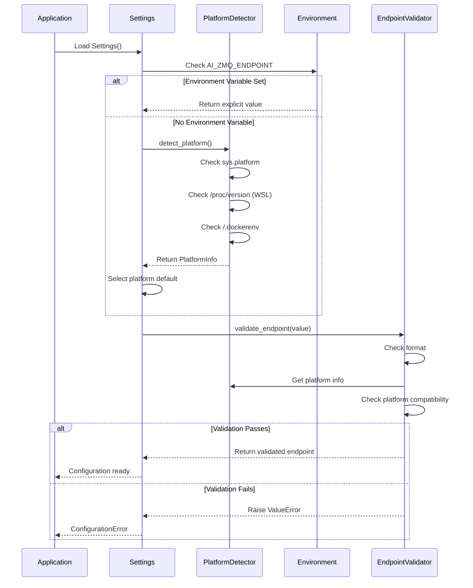
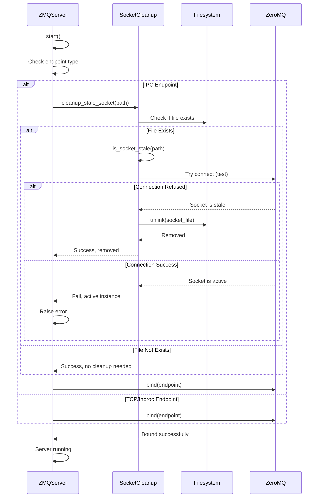

# Cross-Platform ZeroMQ Architecture Design

## Executive Summary

This document provides a comprehensive architectural design for resolving platform-specific ZeroMQ (ZMQ) issues in the openkore-AI project, enabling seamless cross-platform operation without manual configuration.

**Problem**: Python AI Sidecar defaults to Unix IPC sockets which fail on Windows, requiring manual TCP configuration.

**Solution**: Automatic platform detection, intelligent endpoint selection, socket cleanup, and configuration validation with full backward compatibility.

---

## Table of Contents

1. [Current State Analysis](#1-current-state-analysis)
2. [Platform Detection Strategy](#2-platform-detection-strategy)
3. [Configuration Architecture](#3-configuration-architecture)
4. [Socket Cleanup Strategy](#4-socket-cleanup-strategy)
5. [Validation & Error Handling](#5-validation--error-handling)
6. [Testing Strategy](#6-testing-strategy)
7. [Implementation Order](#7-implementation-order)
8. [Architecture Diagrams](#8-architecture-diagrams)
9. [Risk Mitigation](#9-risk-mitigation)

---

## 1. Current State Analysis

### 1.1 Problem Statement

**Current Implementation (`ai_sidecar/config.py:27-29`)**:
```python
DEFAULT_ZMQ_ENDPOINT_UNIX = "ipc:///tmp/openkore-ai.sock"
DEFAULT_ZMQ_ENDPOINT_WINDOWS = "tcp://127.0.0.1:5555"
DEFAULT_ZMQ_ENDPOINT = DEFAULT_ZMQ_ENDPOINT_UNIX  # ❌ Always Unix!
```

**Issues Identified**:
1. **Platform-Agnostic Default**: Always uses Unix IPC endpoint
2. **Windows Incompatibility**: IPC sockets don't work on Windows
3. **No Automatic Detection**: Requires manual environment variable override
4. **Stale Socket Files**: Unix IPC socket files persist after crashes
5. **Poor Error Messages**: No validation that IPC isn't used on Windows
6. **Deployment Complexity**: Different config needed per platform

### 1.2 Impact Matrix

| Platform | Current Behavior | Workaround | User Impact |
|----------|------------------|------------|-------------|
| **Windows** | ❌ Fails to bind | Set `AI_ZMQ_ENDPOINT=tcp://127.0.0.1:5555` | High - Broken OOBE |
| **Linux/macOS** | ✅ Works (IPC optimal) | None | Low - Works |
| **WSL 1** | ❌ IPC may fail | Manual TCP config | Medium - Inconsistent |
| **WSL 2** | ✅ IPC works | None | Low - Works |
| **Docker** | ✅ Works | None if volume-mounted | Low - Works |
| **Cygwin** | ❌ Fails | Manual TCP config | High - Broken |

### 1.3 Affected Files

**Primary (Require Changes)**:
1. [`ai_sidecar/config.py`](../ai_sidecar/config.py) - Configuration system
2. [`ai_sidecar/ipc/zmq_server.py`](../ai_sidecar/ipc/zmq_server.py) - ZMQ server
3. [`ai_sidecar/utils/errors.py`](../ai_sidecar/utils/errors.py) - Error definitions

**Secondary (Documentation/Examples)**:
4. [`ai_sidecar/.env.example`](../ai_sidecar/.env.example) - Config template
5. [`README.md`](../README.md) - Main documentation

**Tertiary (Validation)**:
6. [`validate_bridges.sh`](../validate_bridges.sh) - Validation script
7. New test files for platform detection

---

## 2. Platform Detection Strategy

### 2.1 Detection Logic Architecture

Create new module: `ai_sidecar/utils/platform.py`

**Responsibilities**:
- Detect operating system at runtime
- Handle edge cases (WSL, Cygwin, Docker)
- Provide platform-appropriate defaults
- Cache detection result (immutable during runtime)

**Detection Algorithm**:

```
┌─────────────────────────────────────────────────────────────┐
│               Platform Detection Decision Tree               │
├─────────────────────────────────────────────────────────────┤
│                                                               │
│  1. sys.platform == "win32"?                                  │
│     ├─ YES → Check for WSL marker                            │
│     │   ├─ /proc/version contains "microsoft"?               │
│     │   │   ├─ YES → PlatformType.WSL                        │
│     │   │   └─ NO → PlatformType.WINDOWS                     │
│     │   └─ Exception reading /proc/version?                  │
│     │       └─ PlatformType.WINDOWS (safe fallback)          │
│     └─ NO → Continue                                          │
│                                                               │
│  2. sys.platform starts with "cygwin"?                        │
│     ├─ YES → PlatformType.WINDOWS (treat as Windows)         │
│     └─ NO → Continue                                          │
│                                                               │
│  3. sys.platform in ["linux", "darwin", "freebsd"]?          │
│     ├─ YES → PlatformType.UNIX_LIKE                          │
│     └─ NO → Continue                                          │
│                                                               │
│  4. os.name == "posix"?                                       │
│     ├─ YES → PlatformType.UNIX_LIKE                          │
│     └─ NO → PlatformType.UNKNOWN                             │
│                                                               │
└─────────────────────────────────────────────────────────────┘
```

### 2.2 Module Design: `ai_sidecar/utils/platform.py`

```python
"""
Platform detection and configuration module.

Provides runtime platform detection and platform-specific defaults
for ZeroMQ endpoints and file paths.
"""

from enum import Enum
from functools import lru_cache
import os
import sys
from pathlib import Path
from typing import Literal

class PlatformType(str, Enum):
    """Platform types for configuration selection."""
    WINDOWS = "windows"
    UNIX_LIKE = "unix_like"
    WSL = "wsl"
    UNKNOWN = "unknown"

class PlatformInfo:
    """Container for platform detection results."""
    type: PlatformType
    can_use_ipc: bool
    default_ipc_path: str | None
    default_tcp_endpoint: str
    is_container: bool
    
@lru_cache(maxsize=1)
def detect_platform() -> PlatformInfo:
    """
    Detect current platform with edge case handling.
    
    Cached for performance (immutable during process lifetime).
    
    Returns:
        PlatformInfo with detection results
    """
    # Implementation details...
    
def get_default_zmq_endpoint() -> str:
    """
    Get platform-appropriate default ZMQ endpoint.
    
    Returns:
        - Unix/Linux/macOS: "ipc:///tmp/openkore-ai.sock"
        - Windows/Cygwin: "tcp://127.0.0.1:5555"
        - WSL: "ipc:///tmp/openkore-ai.sock" (WSL2 supports IPC)
    """
    # Implementation details...

def validate_endpoint_for_platform(endpoint: str) -> tuple[bool, str | None]:
    """
    Validate that endpoint is compatible with current platform.
    
    Returns:
        Tuple of (is_valid, error_message)
    """
    # Implementation details...
```

### 2.3 Edge Case Handling

| Environment | Detection Method | IPC Support | Default Endpoint |
|-------------|------------------|-------------|------------------|
| **Windows Native** | `sys.platform == "win32"` + no `/proc/version` | ❌ No | `tcp://127.0.0.1:5555` |
| **WSL 1** | `win32` + `/proc/version` contains "Microsoft" | ⚠️ Limited | `tcp://127.0.0.1:5555` (safe) |
| **WSL 2** | `linux` + `/proc/version` contains "microsoft" | ✅ Yes | `ipc:///tmp/openkore-ai.sock` |
| **Cygwin** | `sys.platform.startswith("cygwin")` | ❌ No | `tcp://127.0.0.1:5555` |
| **Docker (Linux)** | `linux` + check `/proc/1/cgroup` | ✅ Yes | `ipc:///tmp/openkore-ai.sock` |
| **macOS** | `sys.platform == "darwin"` | ✅ Yes | `ipc:///tmp/openkore-ai.sock` |
| **FreeBSD** | `sys.platform.startswith("freebsd")` | ✅ Yes | `ipc:///tmp/openkore-ai.sock` |

**WSL Detection Logic**:
```python
def _is_wsl() -> tuple[bool, int]:
    """
    Detect Windows Subsystem for Linux.
    
    Returns:
        (is_wsl, wsl_version)
        - (False, 0): Not WSL
        - (True, 1): WSL 1
        - (True, 2): WSL 2
    """
    try:
        with open("/proc/version", "r") as f:
            version = f.read().lower()
            if "microsoft" in version:
                # WSL 2 uses "microsoft" (lowercase)
                # WSL 1 uses "Microsoft" (capitalized) but also matches
                # Additional check: WSL 2 has full Linux kernel
                if "wsl2" in version or "-microsoft-standard" in version:
                    return (True, 2)
                return (True, 1)
    except (FileNotFoundError, PermissionError):
        pass
    return (False, 0)
```

### 2.4 Container Detection

**Docker Detection**:
```python
def _is_docker() -> bool:
    """
    Detect if running inside Docker container.
    
    Checks:
    1. /.dockerenv file exists
    2. /proc/1/cgroup contains "docker"
    """
    # Check 1: Docker environment file
    if Path("/.dockerenv").exists():
        return True
    
    # Check 2: cgroup contains docker
    try:
        with open("/proc/1/cgroup", "r") as f:
            return "docker" in f.read()
    except (FileNotFoundError, PermissionError):
        return False
```

---

## 3. Configuration Architecture

### 3.1 Modified Configuration Flow



### 3.2 Changes to `ai_sidecar/config.py`

**Strategy**: Modify existing code, minimize new code, preserve all features.

**Required Modifications**:

1. **Add Import** (after line 16):
```python
from ai_sidecar.utils.platform import get_default_zmq_endpoint, validate_endpoint_for_platform
```

2. **Replace Default Assignment** (line 29):
```python
# OLD:
DEFAULT_ZMQ_ENDPOINT = DEFAULT_ZMQ_ENDPOINT_UNIX

# NEW:
DEFAULT_ZMQ_ENDPOINT = get_default_zmq_endpoint()
```

3. **Enhanced Validator** (replace `validate_endpoint` at line 95-124):
```python
@field_validator("endpoint", mode="before")
@classmethod
def validate_endpoint(cls, v: str) -> str:
    """
    Validate ZMQ endpoint format and platform compatibility.
    
    Checks:
    1. Endpoint format (ipc://, tcp://, inproc://)
    2. TCP endpoint has host:port
    3. IPC endpoint not used on Windows
    """
    v = str(v).strip()
    
    if not v:
        raise ValueError(
            "Endpoint cannot be empty. "
            f"Use '{DEFAULT_ZMQ_ENDPOINT}' for local or 'tcp://host:port' for remote."
        )
    
    # Format validation
    valid_prefixes = ("ipc://", "tcp://", "inproc://")
    if not any(v.startswith(p) for p in valid_prefixes):
        raise ValueError(
            f"Invalid endpoint format: '{v}'. "
            f"Must start with one of: {', '.join(valid_prefixes)}. "
            f"Example: 'tcp://127.0.0.1:5555' or 'ipc:///tmp/openkore-ai.sock'"
        )
    
    # TCP-specific validation
    if v.startswith("tcp://"):
        addr = v[6:]
        if ":" not in addr:
            raise ValueError(
                f"TCP endpoint '{v}' must include port. "
                "Example: 'tcp://127.0.0.1:5555'"
            )
    
    # Platform compatibility validation
    is_valid, error_msg = validate_endpoint_for_platform(v)
    if not is_valid:
        raise ValueError(error_msg)
    
    return v
```

### 3.3 Backward Compatibility Strategy

**Design Principle**: Explicit configuration always wins over auto-detection.

**Compatibility Matrix**:

| User Config | Platform | Old Behavior | New Behavior | Compatible? |
|-------------|----------|--------------|--------------|-------------|
| Not Set | Windows | Fails (IPC) | Uses TCP | ✅ Fixed |
| Not Set | Unix | IPC | IPC | ✅ Same |
| `AI_ZMQ_ENDPOINT=tcp://...` | Any | TCP | TCP | ✅ Same |
| `AI_ZMQ_ENDPOINT=ipc://...` | Windows | Fails | Error + Suggestion | ✅ Better |
| `AI_ZMQ_ENDPOINT=ipc://...` | Unix | IPC | IPC | ✅ Same |

**Breaking Changes**: None - all existing configurations continue to work.

**Improvements**:
- Windows now works out-of-the-box
- Better error messages when misconfigured
- Automatic cleanup reduces connection issues

---

## 4. Socket Cleanup Strategy

### 4.1 Socket Lifecycle Management

**Problem**: IPC socket files (`/tmp/openkore-ai.sock`) persist after:
- Application crashes
- SIGKILL termination
- System shutdown

**Effect**: Next startup fails with "Address already in use"

### 4.2 Cleanup Architecture

Create new module: `ai_sidecar/ipc/socket_cleanup.py`

**Module Responsibilities**:
1. Detect stale IPC socket files
2. Safely remove stale sockets before binding
3. Handle race conditions (multiple instances)
4. Log cleanup operations
5. Skip cleanup on Windows (not applicable)

**Cleanup Decision Tree**:



### 4.3 Stale Socket Detection

**Method 1: Connection Test (Preferred)**
```python
def is_socket_stale(socket_path: Path) -> bool:
    """
    Test if IPC socket is stale by attempting connection.
    
    Stale = file exists but no process listening.
    
    Returns:
        True if stale (safe to remove), False if active
    """
    import zmq
    
    context = zmq.Context()
    test_socket = context.socket(zmq.REQ)
    test_socket.setsockopt(zmq.LINGER, 0)
    test_socket.setsockopt(zmq.RCVTIMEO, 100)  # 100ms timeout
    
    try:
        test_socket.connect(f"ipc://{socket_path}")
        test_socket.send(b"ping")
        # If recv succeeds, socket is active
        test_socket.recv()
        return False  # Active connection
    except zmq.Again:
        # Timeout = connection established but no response
        # Could be slow server, not necessarily stale
        return False
    except zmq.ZMQError as e:
        # Connection refused = stale socket file
        return True
    finally:
        test_socket.close()
        context.term()
```

**Method 2: File Age Check (Fallback)**
```python
def is_socket_old(socket_path: Path, max_age_seconds: int = 300) -> bool:
    """
    Check if socket file is older than threshold.
    
    Use as fallback if connection test fails.
    
    Args:
        socket_path: Path to IPC socket file
        max_age_seconds: Age threshold (default 5 minutes)
    
    Returns:
        True if file is old (potentially stale)
    """
    import time
    
    if not socket_path.exists():
        return False
    
    mtime = socket_path.stat().st_mtime
    age = time.time() - mtime
    return age > max_age_seconds
```

### 4.4 Safe Removal Logic

```python
def cleanup_stale_socket(socket_path: Path) -> tuple[bool, str]:
    """
    Safely remove stale IPC socket file.
    
    Handles:
    - Permission errors
    - Race conditions (file removed between check and remove)
    - Logging for audit trail
    
    Returns:
        Tuple of (success, message)
    """
    from ai_sidecar.utils.logging import get_logger
    
    logger = get_logger(__name__)
    
    if not socket_path.exists():
        return (True, "Socket file does not exist")
    
    # Check if stale
    if not is_socket_stale(socket_path):
        return (False, "Socket is active - another instance running")
    
    # Attempt removal
    try:
        socket_path.unlink()
        logger.warning(
            "Removed stale IPC socket",
            path=str(socket_path),
            reason="No active listener detected"
        )
        return (True, f"Removed stale socket: {socket_path}")
    except PermissionError:
        return (False, f"Permission denied to remove socket: {socket_path}")
    except FileNotFoundError:
        # Race condition - another process removed it
        return (True, "Socket already removed")
    except Exception as e:
        return (False, f"Unexpected error removing socket: {e}")
```

### 4.5 Integration into ZMQ Server

**Modification to `ai_sidecar/ipc/zmq_server.py`**:

Add cleanup logic in `start()` method (before line 108):

```python
async def start(self) -> None:
    """Start the ZeroMQ server with automatic socket cleanup."""
    
    if self._running:
        logger.warning("Server already running")
        return
    
    logger.info("Starting ZMQ server", endpoint=self._config.endpoint)
    
    # NEW: Cleanup stale socket if IPC endpoint
    if self._config.endpoint.startswith("ipc://"):
        from ai_sidecar.ipc.socket_cleanup import cleanup_stale_socket
        from pathlib import Path
        
        socket_path = Path(self._config.endpoint[6:])  # Remove "ipc://"
        success, message = cleanup_stale_socket(socket_path)
        
        if not success and "active" in message.lower():
            raise ZMQConnectionError(
                f"Cannot bind to {self._config.endpoint}: {message}",
                endpoint=self._config.endpoint,
            )
        
        if success and "Removed" in message:
            logger.warning("Cleaned up stale socket", path=str(socket_path))
    
    # Continue with existing bind logic...
```

---

## 5. Validation & Error Handling

### 5.1 New Error Classes

Add to `ai_sidecar/utils/errors.py`:

```python
class PlatformCompatibilityError(ConfigurationError):
    """
    Raised when configuration is incompatible with current platform.
    
    Example: Using IPC endpoint on Windows
    """
    
    def __init__(
        self,
        endpoint: str,
        platform: str,
        reason: str,
    ) -> None:
        suggestions = [
            RecoverySuggestion(
                "Use platform-appropriate endpoint",
                [
                    f"Current platform: {platform}",
                    f"Problematic endpoint: {endpoint}",
                    f"Issue: {reason}",
                    "",
                    "On Windows, use TCP:",
                    "  AI_ZMQ_ENDPOINT=tcp://127.0.0.1:5555",
                    "",
                    "On Unix/Linux/macOS, use IPC (faster):",
                    "  AI_ZMQ_ENDPOINT=ipc:///tmp/openkore-ai.sock",
                    "",
                    "Or remove AI_ZMQ_ENDPOINT to use automatic detection",
                ],
            )
        ]
        
        super().__init__(
            message=f"Endpoint '{endpoint}' incompatible with platform '{platform}': {reason}",
            config_key="AI_ZMQ_ENDPOINT",
            suggestions=suggestions,
        )

class SocketCleanupError(ResourceError):
    """
    Raised when IPC socket cleanup fails.
    """
    
    def __init__(self, socket_path: str, reason: str) -> None:
        suggestions = [
            RecoverySuggestion(
                "Manually remove the socket file",
                [
                    f"Socket path: {socket_path}",
                    f"Remove with: rm {socket_path}",
                    "Then restart the AI Sidecar",
                ],
            ),
            RecoverySuggestion(
                "Use TCP endpoint instead",
                [
                    "Set AI_ZMQ_ENDPOINT=tcp://127.0.0.1:5555",
                    "TCP doesn't have socket file issues",
                ],
            ),
        ]
        
        super().__init__(
            message=f"Failed to cleanup IPC socket: {reason}",
            resource_type="ipc_socket",
            suggestions=suggestions,
        )
```

### 5.2 Validation Rules

| Validation | Rule | Error Type | Severity |
|------------|------|------------|----------|
| **Format Check** | Starts with `ipc://`, `tcp://`, or `inproc://` | ValueError | Critical |
| **TCP Port Check** | TCP endpoint has `:port` | ValueError | Critical |
| **Platform Check** | IPC not used on Windows/Cygwin | PlatformCompatibilityError | Critical |
| **IPC Path Check** | IPC path is absolute (starts with `/`) | ValueError | Critical |
| **TCP Bind Check** | TCP bind address valid (IPv4/IPv6/hostname) | ValueError | Critical |

### 5.3 Enhanced Error Messages

**Before** (Windows user tries default):
```
zmq.error.ZMQError: No such file or directory
```

**After** (with validation):
```
═══════════════════════════════════════════════════════════
❌ Error: Platform Incompatibility Detected
   Category: configuration
═══════════════════════════════════════════════════════════
📋 Context:
   • endpoint: ipc:///tmp/openkore-ai.sock
   • platform: Windows
   • can_use_ipc: False

🛠️ How to fix:
💡 Use platform-appropriate endpoint
   1. Current platform: Windows
   2. Problematic endpoint: ipc:///tmp/openkore-ai.sock
   3. Issue: IPC sockets not supported on Windows

   On Windows, use TCP:
     AI_ZMQ_ENDPOINT=tcp://127.0.0.1:5555

   Or remove AI_ZMQ_ENDPOINT to use automatic detection

═══════════════════════════════════════════════════════════
```

---

## 6. Testing Strategy

### 6.1 Test Categories



### 6.2 Unit Test Suite

**File**: `ai_sidecar/tests/test_platform_detection.py`

**Test Cases**:

```python
import pytest
import platform
from unittest.mock import patch, mock_open
from ai_sidecar.utils.platform import (
    detect_platform,
    get_default_zmq_endpoint,
    validate_endpoint_for_platform,
    PlatformType,
)

class TestPlatformDetection:
    """Test platform detection logic."""
    
    def test_windows_detection(self):
        """Test Windows platform detection."""
        with patch('sys.platform', 'win32'):
            with patch('pathlib.Path.exists', return_value=False):
                info = detect_platform()
                assert info.type == PlatformType.WINDOWS
                assert not info.can_use_ipc
                assert info.default_tcp_endpoint == "tcp://127.0.0.1:5555"
    
    def test_linux_detection(self):
        """Test Linux platform detection."""
        with patch('sys.platform', 'linux'):
            info = detect_platform()
            assert info.type == PlatformType.UNIX_LIKE
            assert info.can_use_ipc
    
    def test_wsl1_detection(self):
        """Test WSL 1 detection (should use TCP)."""
        with patch('sys.platform', 'win32'):
            mock_version = "Linux version 4.4.0-19041-Microsoft"
            with patch('builtins.open', mock_open(read_data=mock_version)):
                info = detect_platform()
                assert info.type == PlatformType.WSL
                # WSL 1 should use TCP for safety
                assert not info.can_use_ipc
    
    def test_wsl2_detection(self):
        """Test WSL 2 detection (can use IPC)."""
        with patch('sys.platform', 'linux'):
            mock_version = "Linux version 5.10.16.3-microsoft-standard-WSL2"
            with patch('builtins.open', mock_open(read_data=mock_version)):
                info = detect_platform()
                assert info.type == PlatformType.WSL
                assert info.can_use_ipc  # WSL 2 supports IPC
    
    def test_macos_detection(self):
        """Test macOS platform detection."""
        with patch('sys.platform', 'darwin'):
            info = detect_platform()
            assert info.type == PlatformType.UNIX_LIKE
            assert info.can_use_ipc
    
    def test_docker_detection(self):
        """Test Docker container detection."""
        with patch('sys.platform', 'linux'):
            with patch('pathlib.Path.exists', return_value=True):
                info = detect_platform()
                assert info.is_container

class TestDefaultEndpoints:
    """Test automatic endpoint selection."""
    
    def test_windows_gets_tcp(self):
        """Windows should default to TCP."""
        with patch('ai_sidecar.utils.platform.detect_platform') as mock:
            mock.return_value.can_use_ipc = False
            endpoint = get_default_zmq_endpoint()
            assert endpoint == "tcp://127.0.0.1:5555"
    
    def test_unix_gets_ipc(self):
        """Unix should default to IPC."""
        with patch('ai_sidecar.utils.platform.detect_platform') as mock:
            mock.return_value.can_use_ipc = True
            endpoint = get_default_zmq_endpoint()
            assert endpoint == "ipc:///tmp/openkore-ai.sock"

class TestEndpointValidation:
    """Test endpoint validation logic."""
    
    def test_ipc_on_windows_rejected(self):
        """IPC endpoint should fail validation on Windows."""
        with patch('ai_sidecar.utils.platform.detect_platform') as mock:
            mock.return_value.type = PlatformType.WINDOWS
            mock.return_value.can_use_ipc = False
            
            is_valid, error = validate_endpoint_for_platform("ipc:///tmp/test.sock")
            assert not is_valid
            assert "not supported on Windows" in error
    
    def test_tcp_on_windows_accepted(self):
        """TCP endpoint should work on Windows."""
        with patch('ai_sidecar.utils.platform.detect_platform') as mock:
            mock.return_value.type = PlatformType.WINDOWS
            
            is_valid, error = validate_endpoint_for_platform("tcp://127.0.0.1:5555")
            assert is_valid
            assert error is None
    
    def test_ipc_on_unix_accepted(self):
        """IPC endpoint should work on Unix."""
        with patch('ai_sidecar.utils.platform.detect_platform') as mock:
            mock.return_value.type = PlatformType.UNIX_LIKE
            mock.return_value.can_use_ipc = True
            
            is_valid, error = validate_endpoint_for_platform("ipc:///tmp/test.sock")
            assert is_valid
            assert error is None
```

**File**: `ai_sidecar/tests/test_socket_cleanup.py`

**Test Cases**:

```python
import pytest
from pathlib import Path
from unittest.mock import Mock, patch
from ai_sidecar.ipc.socket_cleanup import (
    is_socket_stale,
    cleanup_stale_socket,
    is_socket_old,
)

class TestSocketStaleDetection:
    """Test stale socket detection."""
    
    def test_active_socket_detected(self, tmp_path):
        """Active socket should not be marked stale."""
        # Create actual ZMQ server for testing
        import zmq
        context = zmq.Context()
        server = context.socket(zmq.REP)
        socket_path = tmp_path / "test.sock"
        server.bind(f"ipc://{socket_path}")
        
        try:
            assert not is_socket_stale(socket_path)
        finally:
            server.close()
            context.term()
    
    def test_stale_socket_detected(self, tmp_path):
        """Stale socket file should be detected."""
        socket_path = tmp_path / "stale.sock"
        socket_path.touch()  # Create empty file
        
        assert is_socket_stale(socket_path)
    
    def test_nonexistent_socket(self, tmp_path):
        """Nonexistent socket should be considered stale."""
        socket_path = tmp_path / "nonexistent.sock"
        assert is_socket_stale(socket_path)

class TestSocketCleanup:
    """Test socket cleanup logic."""
    
    def test_cleanup_stale_socket(self, tmp_path):
        """Should successfully remove stale socket."""
        socket_path = tmp_path / "stale.sock"
        socket_path.touch()
        
        success, msg = cleanup_stale_socket(socket_path)
        assert success
        assert not socket_path.exists()
    
    def test_cleanup_active_socket_fails(self, tmp_path):
        """Should not remove active socket."""
        # Create active server
        import zmq
        context = zmq.Context()
        server = context.socket(zmq.REP)
        socket_path = tmp_path / "active.sock"
        server.bind(f"ipc://{socket_path}")
        
        try:
            success, msg = cleanup_stale_socket(socket_path)
            assert not success
            assert "active" in msg.lower()
            assert socket_path.exists()
        finally:
            server.close()
            context.term()
    
    def test_cleanup_nonexistent_socket(self, tmp_path):
        """Should handle nonexistent socket gracefully."""
        socket_path = tmp_path / "nonexistent.sock"
        success, msg = cleanup_stale_socket(socket_path)
        assert success  # Not an error - file doesn't exist
```

### 6.3 Integration Test Suite

**File**: `ai_sidecar/tests/test_cross_platform_integration.py`

**Test Scenarios**:

1. **Auto-Detection Works**
   - Test on each platform
   - Verify correct endpoint selected
   - Verify server binds successfully

2. **Manual Override Works**
   - Set `AI_ZMQ_ENDPOINT` explicitly
   - Verify override takes precedence
   - Verify validation still applies

3. **Cleanup Works**
   - Create stale socket
   - Start server
   - Verify cleanup occurred
   - Verify server started

4. **Error Handling**
   - Invalid endpoint format
   - IPC on Windows
   - Active socket conflict
   - Permission denied

### 6.4 End-to-End Tests

**File**: `tests/test_e2e_platform.py`

**Test Flow**:

```
1. Platform-Specific E2E
   ├─ Windows: Start with no config → Should use TCP → Connect Perl client → Exchange messages
   ├─ Linux: Start with no config → Should use IPC → Connect Perl client → Exchange messages
   └─ Docker: Start in container → Should use IPC → Connect Perl client → Exchange messages

2. Configuration Override E2E
   ├─ Set explicit TCP → Should use TCP on all platforms → Connect → Exchange
   └─ Set explicit IPC (Unix only) → Should use IPC → Connect → Exchange

3. Error Recovery E2E
   ├─ Stale socket → Should cleanup → Start successfully
   └─ Active socket → Should error with helpful message
```

### 6.5 Platform Test Matrix (CI/CD)

**GitHub Actions Matrix**:

```yaml
# .github/workflows/platform-tests.yml
name: Cross-Platform Tests

on: [push, pull_request]

jobs:
  test:
    strategy:
      matrix:
        os: [ubuntu-latest, windows-latest, macos-latest]
        python-version: ['3.10', '3.11', '3.12']
    
    runs-on: ${{ matrix.os }}
    
    steps:
      - uses: actions/checkout@v4
      - uses: actions/setup-python@v5
        with:
          python-version: ${{ matrix.python-version }}
      
      - name: Install dependencies
        run: |
          pip install -e .
          pip install pytest pytest-cov pytest-asyncio
      
      - name: Run platform detection tests
        run: pytest ai_sidecar/tests/test_platform_detection.py -v
      
      - name: Run socket cleanup tests (Unix only)
        if: runner.os != 'Windows'
        run: pytest ai_sidecar/tests/test_socket_cleanup.py -v
      
      - name: Run integration tests
        run: pytest ai_sidecar/tests/test_cross_platform_integration.py -v
```

---

## 7. Implementation Order

### 7.1 Phase-Based Implementation



### 7.2 Detailed Implementation Steps

#### **Step 1: Create Platform Detection Module** (Priority: P0 - Critical)

**File**: `ai_sidecar/utils/platform.py` (NEW)

**Dependencies**: None (stdlib only)

**Tasks**:
- [ ] Define `PlatformType` enum
- [ ] Define `PlatformInfo` dataclass
- [ ] Implement `detect_platform()` with caching
- [ ] Implement WSL detection logic
- [ ] Implement Docker detection logic
- [ ] Implement `get_default_zmq_endpoint()`
- [ ] Implement `validate_endpoint_for_platform()`
- [ ] Add comprehensive docstrings

**Testing**: Write unit tests first (TDD)

**Risk**: Low - Pure function, well-defined inputs/outputs

---

#### **Step 2: Update Configuration System** (Priority: P0 - Critical)

**File**: `ai_sidecar/config.py` (MODIFY)

**Dependencies**: Requires Step 1 complete

**Tasks**:
- [ ] Add import: `from ai_sidecar.utils.platform import ...`
- [ ] Replace line 29: `DEFAULT_ZMQ_ENDPOINT = get_default_zmq_endpoint()`
- [ ] Enhance `validate_endpoint()` method (lines 95-124)
- [ ] Add platform compatibility check
- [ ] Preserve all existing validation logic
- [ ] Update docstrings

**Testing**: Config loading tests, validation tests

**Risk**: Medium - Modifying core config, needs careful testing

---

#### **Step 3: Implement Socket Cleanup** (Priority: P1 - High)

**File**: `ai_sidecar/ipc/socket_cleanup.py` (NEW)

**Dependencies**: Requires Step 1 complete

**Tasks**:
- [ ] Implement `is_socket_stale()` with connection test
- [ ] Implement `is_socket_old()` as fallback
- [ ] Implement `cleanup_stale_socket()` with error handling
- [ ] Add logging for audit trail
- [ ] Handle race conditions
- [ ] Skip cleanup on Windows platforms

**Testing**: Socket lifecycle tests with real ZMQ sockets

**Risk**: Medium - Race conditions possible, needs careful design

---

#### **Step 4: Integrate Cleanup into Server** (Priority: P1 - High)

**File**: `ai_sidecar/ipc/zmq_server.py` (MODIFY)

**Dependencies**: Requires Steps 1 & 3 complete

**Tasks**:
- [ ] Import socket cleanup utilities
- [ ] Add cleanup logic before bind (in `start()` method)
- [ ] Handle cleanup errors appropriately
- [ ] Add logging for cleanup operations
- [ ] Preserve existing server logic

**Testing**: Server startup tests, cleanup integration tests

**Risk**: Low - Well-isolated changes

---

#### **Step 5: Add Enhanced Error Classes** (Priority: P1 - High)

**File**: `ai_sidecar/utils/errors.py` (MODIFY)

**Dependencies**: Requires Step 1 complete

**Tasks**:
- [ ] Add `PlatformCompatibilityError` class
- [ ] Add `SocketCleanupError` class
- [ ] Update error suggestions with platform-specific guidance
- [ ] Preserve existing error classes

**Testing**: Error formatting tests

**Risk**: Low - Additive changes only

---

#### **Step 6: Update Documentation** (Priority: P2 - Medium)

**Files**: `.env.example`, `README.md`

**Dependencies**: Can proceed in parallel with Steps 3-5

**Tasks**:

**`.env.example` changes**:
- [ ] Update comment for `AI_ZMQ_ENDPOINT` (line 24-27)
- [ ] Add platform-specific examples
- [ ] Explain automatic detection
- [ ] Add troubleshooting notes

**`README.md` changes**:
- [ ] Update Quick Start section (lines 275-280, 432)
- [ ] Remove manual TCP config requirement for Windows
- [ ] Add note about automatic platform detection
- [ ] Update troubleshooting section (lines 746-790)
- [ ] Add new section on platform compatibility

**Testing**: Documentation review

**Risk**: Very Low - Documentation only

---

#### **Step 7: Update Validation Script** (Priority: P2 - Medium)

**File**: `validate_bridges.sh` (MODIFY)

**Dependencies**: None (can proceed in parallel)

**Tasks**:
- [ ] Add platform detection check
- [ ] Add endpoint validation check
- [ ] Add IPC socket cleanup check (Unix only)
- [ ] Update success criteria

**Testing**: Run script on all platforms

**Risk**: Low - Validation script, non-critical

---

#### **Step 8: Add Integration Tests** (Priority: P1 - High)

**File**: `ai_sidecar/tests/test_cross_platform_integration.py` (NEW)

**Dependencies**: Requires Steps 1-5 complete

**Tasks**:
- [ ] Test auto-detection on mocked platforms
- [ ] Test manual override behavior
- [ ] Test cleanup integration
- [ ] Test error scenarios
- [ ] Test backward compatibility

**Testing**: Self-testing (tests the tests)

**Risk**: Low - Test code only

---

#### **Step 9: Manual Platform Testing** (Priority: P0 - Critical)

**Platforms to Test**:
- [ ] Windows 10/11
- [ ] Ubuntu 22.04 LTS
- [ ] macOS 13+
- [ ] WSL 2 (Ubuntu)
- [ ] Docker (Alpine Linux)

**Test Scenarios**:
1. Fresh install (no `.env`)
2. Explicit TCP config
3. Explicit IPC config (Unix only)
4. Stale socket cleanup
5. Perl → Python communication

**Risk**: High - Real-world validation critical

---

### 7.3 Dependency Graph



**Critical Path**: Steps 1 → 2 → 8 → 9 (Must complete sequentially)

**Parallel Tracks**: Steps 6 & 7 can proceed independently

---

## 8. Architecture Diagrams

### 8.1 System Architecture

```mermaid
graph TB
    subgraph "Perl - OpenKore"
        PerlClient[AI_Bridge.pl<br/>ZMQ REQ Client]
        PerlConfig[config.txt<br/>AI_Bridge_address]
    end
    
    subgraph "Python - AI Sidecar"
        ConfigLoad[Configuration Loader]
        PlatformDetect[Platform Detector]
        Validator[Endpoint Validator]
        SocketCleanup[Socket Cleanup]
        ZMQServer[ZMQ REP Server]
    end
    
    subgraph "Platform Detection"
        SysPlatform[sys.platform]
        ProcVersion[/proc/version]
        DockerCheck[/.dockerenv]
    end
    
    subgraph "Endpoints"
        IPC[IPC Socket<br/>ipc:///tmp/openkore-ai.sock]
        TCP[TCP Socket<br/>tcp://127.0.0.1:5555]
    end
    
    Start([Application Start]) --> ConfigLoad
    ConfigLoad --> EnvCheck{AI_ZMQ_ENDPOINT<br/>set?}
    
    EnvCheck -->|No| PlatformDetect
    EnvCheck -->|Yes| Validator
    
    PlatformDetect --> SysPlatform
    PlatformDetect --> ProcVersion
    PlatformDetect --> DockerCheck
    PlatformDetect --> SelectEndpoint{Platform?}
    
    SelectEndpoint -->|Windows/Cygwin| TCP
    SelectEndpoint -->|Unix/Linux/macOS| IPC
    SelectEndpoint -->|WSL 1| TCP
    SelectEndpoint -->|WSL 2| IPC
    
    IPC --> Validator
    TCP --> Validator
    
    Validator --> Valid{Valid?}
    Valid -->|No| ErrorStop([Configuration Error])
    Valid -->|Yes| CleanupCheck{IPC Endpoint?}
    
    CleanupCheck -->|Yes| SocketCleanup
    CleanupCheck -->|No| ZMQServer
    
    SocketCleanup --> CleanupOK{Cleanup OK?}
    CleanupOK -->|No| ErrorStop
    CleanupOK -->|Yes| ZMQServer
    
    ZMQServer --> ZMQBind{Bind<br/>Successful?}
    ZMQBind -->|No| ErrorStop
    ZMQBind -->|Yes| Ready([Server Ready])
    
    Ready -.->|IPC or TCP| PerlClient
    PerlConfig -.->|Must Match| PerlClient
    
    style Start fill:#e1f5fe
    style Ready fill:#c8e6c9
    style ErrorStop fill:#ffcdd2
    style PlatformDetect fill:#fff9c4
    style SocketCleanup fill:#fff9c4
    style Validator fill:#ffe0b2
```

### 8.2 Platform Detection Module Architecture



### 8.3 Configuration Loading Sequence



### 8.4 Socket Cleanup Flow



---

## 9. Risk Mitigation

### 9.1 Risk Assessment Matrix

| Risk | Likelihood | Impact | Severity | Mitigation |
|------|-----------|--------|----------|------------|
| **Breaking existing deployments** | Low | Critical | High | Extensive backward compat testing |
| **WSL version detection fails** | Medium | Medium | Medium | Fallback to safe TCP mode |
| **Race condition in cleanup** | Low | Medium | Low | File locking, retry logic |
| **Permission errors** | Medium | Low | Low | Clear error messages |
| **Docker volume mount issues** | Low | Medium | Low | Document volume requirements |
| **Perl-Python endpoint mismatch** | Medium | Critical | High | Validation script checks both sides |

### 9.2 Mitigation Strategies

#### **Risk 1: Breaking Existing Deployments**

**Mitigation**:
- ✅ Explicit config always takes precedence (no behavior change)
- ✅ Auto-detection only applies when env var not set
- ✅ Extensive testing on all platforms
- ✅ Rollback plan: Revert to static defaults if issues found

#### **Risk 2: WSL Detection Edge Cases**

**Mitigation**:
- ✅ Conservative approach: WSL 1 uses TCP (safe fallback)
- ✅ Only WSL 2 uses IPC after explicit detection
- ✅ If detection uncertain, default to TCP
- ✅ User can always override with env var

#### **Risk 3: Socket Cleanup Race Conditions**

**Mitigation**:
- ✅ Test connection before removal (don't blindly delete)
- ✅ Handle FileNotFoundError (removed by another process)
- ✅ Short timeout on test connection (100ms)
- ✅ Log all cleanup operations for debugging

#### **Risk 4: Performance Regression**

**Benchmark Requirements**:
- Platform detection: < 1ms (cached after first call)
- Socket cleanup: < 50ms (only on startup)
- Configuration loading: < 10ms (no change expected)

**Mitigation**: Performance tests in CI/CD

---

## 10. Detailed Component Specifications

### 10.1 Platform Detection Module (`platform.py`)

**Purpose**: Centralized, cached platform detection

**Public API**:

```python
# Enum for platform types
class PlatformType(str, Enum):
    WINDOWS = "windows"      # Windows (native)
    UNIX_LIKE = "unix_like"  # Linux, macOS, FreeBSD
    WSL = "wsl"              # Windows Subsystem for Linux
    UNKNOWN = "unknown"      # Unsupported/unknown

# Platform information dataclass
@dataclass(frozen=True)
class PlatformInfo:
    """Immutable platform detection result."""
    type: PlatformType
    can_use_ipc: bool
    default_ipc_path: str | None
    default_tcp_endpoint: str
    is_container: bool
    wsl_version: int  # 0=not WSL, 1=WSL1, 2=WSL2
    platform_name: str

# Main detection function (cached)
@lru_cache(maxsize=1)
def detect_platform() -> PlatformInfo:
    """
    Detect current platform with comprehensive edge case handling.
    
    Cached for performance - result immutable during process lifetime.
    
    Returns:
        PlatformInfo with platform details and capabilities
    """

# Helper functions
def get_default_zmq_endpoint() -> str:
    """Get platform-appropriate default ZMQ endpoint."""

def validate_endpoint_for_platform(endpoint: str) -> tuple[bool, str | None]:
    """
    Validate endpoint compatibility with current platform.
    
    Args:
        endpoint: ZMQ endpoint string to validate
    
    Returns:
        (is_valid, error_message)
        - (True, None) if valid
        - (False, error_msg) if invalid
    """

def get_platform_name() -> str:
    """Get human-readable platform name for logging."""
```

**Implementation Notes**:
- Use `@lru_cache` for performance (detect once)
- Use `@dataclass(frozen=True)` for immutability
- Comprehensive error handling (never crash on detection)
- Verbose logging for debugging

**Testing Requirements**:
- Mock `sys.platform` for each platform
- Mock `/proc/version` for WSL detection
- Mock `/.dockerenv` for Docker detection
- Test all edge cases
- Test caching behavior

---

### 10.2 Socket Cleanup Module (`socket_cleanup.py`)

**Purpose**: Safe IPC socket file lifecycle management

**Public API**:

```python
def cleanup_stale_socket(socket_path: Path) -> tuple[bool, str]:
    """
    Safely cleanup stale IPC socket file.
    
    Performs stale detection before removal to avoid
    removing active sockets.
    
    Args:
        socket_path: Path to IPC socket file
    
    Returns:
        (success, message)
        - (True, msg): Cleanup successful or not needed
        - (False, msg): Cleanup failed (active or error)
    
    Raises:
        SocketCleanupError: On critical cleanup failures
    """

def is_socket_stale(socket_path: Path) -> bool:
    """
    Test if socket file is stale (no listener).
    
    Method: Attempt connection with short timeout.
    
    Returns:
        True if stale (safe to remove), False if active
    """

def is_socket_old(socket_path: Path, max_age_seconds: int = 300) -> bool:
    """
    Check socket file age as fallback staleness check.
    
    Args:
        socket_path: Path to socket
        max_age_seconds: Age threshold (default 5min)
    
    Returns:
        True if older than threshold
    """
```

**Cleanup Policy**:
- **When**: Only before server bind attempt
- **Where**: Only for IPC endpoints
- **How**: Connection test + age check
- **Logging**: Log all cleanup attempts (success/failure)
- **Errors**: Never crash - return failure and let bind fail naturally

**Race Condition Handling**:

```
Scenario: Two instances start simultaneously

Instance A                    Instance B
    |                             |
    ├─ Check socket exists        |
    |  (Yes - stale)               |
    |                             ├─ Check socket exists
    |                             |  (Yes - stale)
    ├─ Test connection            |
    |  (Refused - stale)           |
    ├─ Remove socket              |
    |  (Success)                   ├─ Test connection
    |                             |  (Refused - stale)
    ├─ Bind to socket             |
    |  (Success)                   ├─ Remove socket
    |                             |  (FileNotFoundError - already removed)
    ├─ Server running             ├─ Bind to socket
    |                             |  (Address in use - A already bound)
    |                             ├─ ERROR: Address in use
    |                             └─ Handle error gracefully
```

**Solution**: Handle `FileNotFoundError` as success (another instance cleaned it)

---

### 10.3 Configuration Changes

**Modification Strategy**: Surgical edits to [`config.py`](../ai_sidecar/config.py)

**Change 1: Imports** (Add after line 16)
```python
from ai_sidecar.utils.platform import (
    get_default_zmq_endpoint,
    validate_endpoint_for_platform,
    get_platform_name,
)
```

**Change 2: Default Endpoint** (Replace line 29)
```python
# Dynamic platform-specific default
DEFAULT_ZMQ_ENDPOINT = get_default_zmq_endpoint()
```

**Change 3: Enhanced Validation** (Replace lines 95-124)

See section 3.2 for complete validator code.

**Change 4: Documentation Update** (Update docstring at line 44-51)
```python
"""
ZeroMQ IPC configuration.

Controls communication between AI Sidecar and OpenKore.

Platform Behavior:
    - Windows/Cygwin: Automatically uses TCP (IPC not supported)
    - Linux/macOS: Automatically uses IPC (faster than TCP)
    - WSL 1: Uses TCP (safer)
    - WSL 2: Uses IPC (full Linux compatibility)
    - Docker: Uses IPC (Unix socket)

Manual Override:
    Set AI_ZMQ_ENDPOINT to override automatic detection.
    Both Perl and Python sides must use matching endpoint.

Environment Variables:
    AI_ZMQ_ENDPOINT: Socket address (auto-detected if not set)
    AI_ZMQ_RECV_TIMEOUT_MS: Receive timeout
    AI_ZMQ_SEND_TIMEOUT_MS: Send timeout
"""
```

---

### 10.4 Error Handling Enhancements

**Add to `ai_sidecar/utils/errors.py`**:

**New Error Class 1: Platform Compatibility Error**
```python
class PlatformCompatibilityError(ConfigurationError):
    """
    Endpoint incompatible with current platform.
    
    Example: IPC endpoint on Windows
    """
    
    def __init__(
        self,
        endpoint: str,
        platform: str,
        reason: str,
    ) -> None:
        from ai_sidecar.utils.platform import get_default_zmq_endpoint
        
        default_endpoint = get_default_zmq_endpoint()
        
        suggestions = [
            RecoverySuggestion(
                "Remove manual configuration to use automatic detection",
                [
                    "Delete or comment out AI_ZMQ_ENDPOINT in .env",
                    f"System will automatically use: {default_endpoint}",
                ],
            ),
            RecoverySuggestion(
                "Use platform-compatible endpoint",
                [
                    f"Current platform: {platform}",
                    f"Problematic endpoint: {endpoint}",
                    "",
                    "Windows users - use TCP:",
                    "  AI_ZMQ_ENDPOINT=tcp://127.0.0.1:5555",
                    "",
                    "Unix/Linux/macOS users - use IPC (faster):",
                    "  AI_ZMQ_ENDPOINT=ipc:///tmp/openkore-ai.sock",
                ],
            ),
        ]
        
        super().__init__(
            message=f"Endpoint '{endpoint}' incompatible with {platform}: {reason}",
            config_key="AI_ZMQ_ENDPOINT",
            suggestions=suggestions,
        )
```

**New Error Class 2: Socket Cleanup Error**

See section 5.1 for complete implementation.

---

## 11. Testing Strategy (Detailed)

### 11.1 Test Pyramid

```
              ┌─────────────┐
              │  Manual     │  ← 5% - Real platform testing
              │  Platform   │
              │  Tests      │
              └─────────────┘
            ┌──────────────────┐
            │   End-to-End     │  ← 15% - Full workflow tests
            │   Integration    │
            └──────────────────┘
          ┌─────────────────────────┐
          │   Integration Tests     │  ← 30% - Component interaction
          └─────────────────────────┘
        ┌────────────────────────────────┐
        │      Unit Tests                │  ← 50% - Individual functions
        └────────────────────────────────┘
```

### 11.2 Test Coverage Requirements

**Minimum Coverage**: 90% for modified/new code

**Coverage by Module**:
- `platform.py`: 95% (critical path)
- `socket_cleanup.py`: 90% (includes error paths)
- Modified `config.py`: 85% (existing tests + new)
- Modified `zmq_server.py`: 85% (existing tests + cleanup)
- New error classes: 80% (error formatting)

### 11.3 Test Execution Strategy

**Local Development**:
```bash
# Run all platform tests
pytest ai_sidecar/tests/test_platform_detection.py -v

# Run cleanup tests (Unix only)
pytest ai_sidecar/tests/test_socket_cleanup.py -v

# Run integration tests
pytest ai_sidecar/tests/test_cross_platform_integration.py -v

# Run with coverage
pytest --cov=ai_sidecar.utils.platform \
       --cov=ai_sidecar.ipc.socket_cleanup \
       --cov-report=html \
       --cov-report=term-missing
```

**CI/CD (GitHub Actions)**:
```bash
# Matrix: [ubuntu, windows, macos] × [py3.10, py3.11, py3.12]
# Each combination runs full test suite
# Platform-specific tests skipped on incompatible platforms
```

### 11.4 Manual Testing Checklist

**Per Platform**:

**Windows 10/11**:
- [ ] Fresh install with no `.env` → Should use TCP automatically
- [ ] Explicit TCP config → Should work
- [ ] Explicit IPC config → Should fail with helpful error
- [ ] Start Perl client → Should connect successfully
- [ ] Exchange 100+ messages → Should be stable

**Ubuntu 22.04**:
- [ ] Fresh install → Should use IPC automatically
- [ ] Explicit IPC config → Should work
- [ ] Explicit TCP config → Should work
- [ ] Create stale socket → Should cleanup automatically
- [ ] Start Perl client → Should connect
- [ ] Permission test: non-writable `/tmp` → Should error clearly

**macOS 13+**:
- [ ] Same tests as Ubuntu
- [ ] Socket in `/tmp` vs `/var/tmp` (macOS cleans `/tmp` on reboot)

**WSL 2**:
- [ ] Fresh install → Should use IPC
- [ ] Cross-compatibility: Windows Perl ↔ WSL Python
- [ ] Volume mount considerations

**Docker (Alpine Linux)**:
- [ ] IPC via volume mount
- [ ] TCP for bridge to host

---

## 12. Implementation Pseudocode

### 12.1 Platform Detection (`ai_sidecar/utils/platform.py`)

```python
"""
Platform detection and configuration.

Provides runtime platform detection for automatic ZMQ endpoint selection.
"""

import os
import sys
from dataclasses import dataclass
from enum import Enum
from functools import lru_cache
from pathlib import Path
from typing import Literal

class PlatformType(str, Enum):
    """Supported platform types."""
    WINDOWS = "windows"
    UNIX_LIKE = "unix_like"
    WSL = "wsl"
    UNKNOWN = "unknown"

@dataclass(frozen=True)
class PlatformInfo:
    """Platform detection result (immutable)."""
    type: PlatformType
    can_use_ipc: bool
    default_ipc_path: str | None
    default_tcp_endpoint: str
    is_container: bool
    wsl_version: int  # 0, 1, or 2
    platform_name: str

@lru_cache(maxsize=1)
def detect_platform() -> PlatformInfo:
    """
    Detect current platform.
    
    Detection order:
    1. Check for Windows (sys.platform)
    2. Check for WSL (/proc/version)
    3. Check for Cygwin
    4. Check for Unix-like (Linux, macOS, BSD)
    5. Check for Docker
    
    Returns:
        PlatformInfo with detection results
    """
    
    # STEP 1: Windows detection
    if sys.platform == "win32":
        # Check if actually WSL
        is_wsl, wsl_ver = _check_wsl()
        
        if is_wsl:
            # WSL 1: Use TCP (limited IPC support)
            # WSL 2: Use IPC (full Linux kernel)
            can_ipc = (wsl_ver == 2)
            return PlatformInfo(
                type=PlatformType.WSL,
                can_use_ipc=can_ipc,
                default_ipc_path="/tmp/openkore-ai.sock" if can_ipc else None,
                default_tcp_endpoint="tcp://127.0.0.1:5555",
                is_container=False,
                wsl_version=wsl_ver,
                platform_name=f"WSL {wsl_ver}",
            )
        
        # Native Windows
        return PlatformInfo(
            type=PlatformType.WINDOWS,
            can_use_ipc=False,
            default_ipc_path=None,
            default_tcp_endpoint="tcp://127.0.0.1:5555",
            is_container=False,
            wsl_version=0,
            platform_name="Windows",
        )
    
    # STEP 2: Cygwin detection
    if sys.platform.startswith("cygwin"):
        return PlatformInfo(
            type=PlatformType.WINDOWS,  # Treat as Windows
            can_use_ipc=False,
            default_ipc_path=None,
            default_tcp_endpoint="tcp://127.0.0.1:5555",
            is_container=False,
            wsl_version=0,
            platform_name="Cygwin",
        )
    
    # STEP 3: Unix-like detection
    if sys.platform in ("linux", "darwin", "freebsd") or os.name == "posix":
        is_docker = _check_docker()
        
        # For WSL 2, sys.platform is "linux"
        is_wsl, wsl_ver = _check_wsl()
        
        platform_name = {
            "linux": "Linux",
            "darwin": "macOS",
            "freebsd": "FreeBSD",
        }.get(sys.platform, "Unix-like")
        
        if is_wsl:
            platform_name = f"WSL {wsl_ver}"
        elif is_docker:
            platform_name += " (Docker)"
        
        return PlatformInfo(
            type=PlatformType.WSL if is_wsl else PlatformType.UNIX_LIKE,
            can_use_ipc=True,
            default_ipc_path="/tmp/openkore-ai.sock",
            default_tcp_endpoint="tcp://127.0.0.1:5555",
            is_container=is_docker,
            wsl_version=wsl_ver,
            platform_name=platform_name,
        )
    
    # STEP 4: Unknown platform (fallback to TCP)
    return PlatformInfo(
        type=PlatformType.UNKNOWN,
        can_use_ipc=False,
        default_ipc_path=None,
        default_tcp_endpoint="tcp://127.0.0.1:5555",
        is_container=False,
        wsl_version=0,
        platform_name=sys.platform,
    )

def _check_wsl() -> tuple[bool, int]:
    """
    Detect Windows Subsystem for Linux.
    
    Returns:
        (is_wsl, version) where version is 0, 1, or 2
    """
    try:
        with open("/proc/version", "r") as f:
            version = f.read().lower()
            
            if "microsoft" in version:
                # WSL 2: Contains "wsl2" or "-microsoft-standard"
                if "wsl2" in version or "-microsoft-standard" in version:
                    return (True, 2)
                # WSL 1: Contains "microsoft" but not WSL2 markers
                return (True, 1)
    except (FileNotFoundError, PermissionError, OSError):
        # /proc/version doesn't exist or not readable
        pass
    
    return (False, 0)

def _check_docker() -> bool:
    """
    Detect if running inside Docker container.
    
    Checks:
    1. /.dockerenv file (Docker creates this)
    2. /proc/1/cgroup contains "docker"
    """
    # Check 1: Docker environment file
    if Path("/.dockerenv").exists():
        return True
    
    # Check 2: cgroup check
    try:
        with open("/proc/1/cgroup", "r") as f:
            content = f.read()
            return "docker" in content or "containerd" in content
    except (FileNotFoundError, PermissionError, OSError):
        pass
    
    return False

def get_default_zmq_endpoint() -> str:
    """
    Get platform-appropriate default ZMQ endpoint.
    
    Returns:
        IPC endpoint for Unix-like platforms,
        TCP endpoint for Windows/Cygwin
    """
    info = detect_platform()
    
    if info.can_use_ipc and info.default_ipc_path:
        return f"ipc://{info.default_ipc_path}"
    
    return info.default_tcp_endpoint

def validate_endpoint_for_platform(endpoint: str) -> tuple[bool, str | None]:
    """
    Validate endpoint is compatible with current platform.
    
    Args:
        endpoint: ZMQ endpoint to validate
    
    Returns:
        (is_valid, error_message)
    """
    info = detect_platform()
    
    # IPC endpoint on Windows = invalid
    if endpoint.startswith("ipc://") and not info.can_use_ipc:
        error_msg = (
            f"IPC endpoints are not supported on {info.platform_name}. "
            f"Use TCP endpoint instead: {info.default_tcp_endpoint}"
        )
        return (False, error_msg)
    
    # All other combinations are valid
    return (True, None)

def get_platform_name() -> str:
    """Get human-readable platform name."""
    return detect_platform().platform_name
```

---

### 12.2 Socket Cleanup Implementation

```python
"""
IPC socket cleanup utilities.

Handles stale socket file detection and removal for Unix platforms.
"""

import time
import zmq
from pathlib import Path
from typing import Literal

from ai_sidecar.utils.logging import get_logger
from ai_sidecar.utils.platform import detect_platform

logger = get_logger(__name__)

def cleanup_stale_socket(
    socket_path: Path,
    max_age_seconds: int = 300,
) -> tuple[bool, str]:
    """
    Safely cleanup stale IPC socket file.
    
    Steps:
    1. Check if file exists
    2. Test if socket is stale (connection test)
    3. Remove if stale
    4. Handle race conditions gracefully
    
    Args:
        socket_path: Path to IPC socket file
        max_age_seconds: Max age before considering stale (default 5min)
    
    Returns:
        (success, message)
    """
    
    # Skip cleanup on Windows (not applicable)
    platform_info = detect_platform()
    if not platform_info.can_use_ipc:
        return (True, "Socket cleanup skipped on Windows")
    
    # Check if file exists
    if not socket_path.exists():
        logger.debug("Socket file does not exist, no cleanup needed", path=str(socket_path))
        return (True, "Socket file does not exist")
    
    # Test if socket is stale
    if not is_socket_stale(socket_path):
        logger.warning(
            "Cannot cleanup socket - active instance detected",
            path=str(socket_path),
            suggestion="Another AI Sidecar instance may be running. "
                      "Stop it or use a different endpoint.",
        )
        return (False, "Socket is active - another instance running")
    
    # Additional safety check: age
    if not is_socket_old(socket_path, max_age_seconds):
        logger.info(
            "Socket file is recent but appears stale",
            path=str(socket_path),
            age_seconds=time.time() - socket_path.stat().st_mtime,
        )
    
    # Attempt removal
    try:
        socket_path.unlink()
        logger.warning(
            "Removed stale IPC socket file",
            path=str(socket_path),
            reason="No active listener detected",
        )
        return (True, f"Removed stale socket: {socket_path}")
        
    except PermissionError as e:
        logger.error(
            "Permission denied removing socket",
            path=str(socket_path),
            error=str(e),
        )
        return (False, f"Permission denied: {socket_path}")
        
    except FileNotFoundError:
        # Race condition: another process removed it
        logger.debug(
            "Socket already removed by another process",
            path=str(socket_path),
        )
        return (True, "Socket already removed (race condition)")
        
    except Exception as e:
        logger.exception(
            "Unexpected error removing socket",
            path=str(socket_path),
            error=str(e),
        )
        return (False, f"Unexpected error: {e}")

def is_socket_stale(socket_path: Path) -> bool:
    """
    Test if IPC socket has an active listener.
    
    Method: Attempt ZMQ connection with short timeout.
    
    Args:
        socket_path: Path to IPC socket file
    
    Returns:
        True if stale (no listener), False if active
    """
    
    if not socket_path.exists():
        return True  # Non-existent = stale
    
    # Create temporary test socket
    context = None
    test_socket = None
    
    try:
        context = zmq.Context()
        test_socket = context.socket(zmq.REQ)
        
        # Configure timeouts
        test_socket.setsockopt(zmq.LINGER, 0)
        test_socket.setsockopt(zmq.RCVTIMEO, 100)  # 100ms timeout
        test_socket.setsockopt(zmq.SNDTIMEO, 100)
        
        # Attempt connection
        test_socket.connect(f"ipc://{socket_path}")
        
        # Send test message
        test_socket.send(b'{"type":"ping"}')
        
        # Try to receive response
        try:
            test_socket.recv()
            # Successful recv = active server
            return False
        except zmq.Again:
            # Timeout = connected but no response
            # Could be slow server, treat as active to be safe
            return False
            
    except zmq.ZMQError as e:
        # Connection errors = stale socket
        logger.debug(
            "Socket connection test failed (stale)",
            path=str(socket_path),
            error=str(e),
        )
        return True
        
    except Exception as e:
        # Unknown errors = assume not stale (safe choice)
        logger.warning(
            "Socket staleness test failed with unexpected error",
            path=str(socket_path),
            error=str(e),
        )
        return False
        
    finally:
        # Clean up test socket
        if test_socket:
            test_socket.close()
        if context:
            context.term()

def is_socket_old(
    socket_path: Path,
    max_age_seconds: int = 300,
) -> bool:
    """
    Check if socket file is old (age-based heuristic).
    
    Use as supplementary check with is_socket_stale().
    
    Args:
        socket_path: Path to socket file
        max_age_seconds: Age threshold (default 300 = 5 minutes)
    
    Returns:
        True if older than threshold
    """
    
    if not socket_path.exists():
        return True  # Non-existent = "old"
    
    try:
        mtime = socket_path.stat().st_mtime
        age_seconds = time.time() - mtime
        
        return age_seconds > max_age_seconds
        
    except (OSError, PermissionError) as e:
        logger.warning(
            "Cannot check socket age",
            path=str(socket_path),
            error=str(e),
        )
        return False  # Safe default
```

---

## 13. Documentation Updates

### 13.1 Changes to `.env.example`

**Section**: ZeroMQ Configuration (lines 24-27)

**Old**:
```bash
# ZMQ socket endpoint (REP socket listens here)
# Required: Yes | Default: tcp://127.0.0.1:5555
# Examples: tcp://127.0.0.1:5555, ipc:///tmp/openkore-ai.sock
AI_ZMQ_ENDPOINT=tcp://127.0.0.1:5555
```

**New**:
```bash
# ZMQ socket endpoint (REP socket listens here)
# 
# AUTOMATIC DETECTION (Recommended):
#   Leave this unset or commented out for automatic platform detection:
#   - Windows/Cygwin: Automatically uses tcp://127.0.0.1:5555
#   - Linux/macOS: Automatically uses ipc:///tmp/openkore-ai.sock
#   - WSL 2: Automatically uses ipc:///tmp/openkore-ai.sock
#   - WSL 1: Automatically uses tcp://127.0.0.1:5555 (safer)
# 
# MANUAL OVERRIDE:
#   Uncomment and set to override automatic detection:
#   - For local same-machine: ipc:///tmp/openkore-ai.sock (Unix only, faster)
#   - For remote or Windows: tcp://127.0.0.1:5555 (works everywhere)
#   - For remote network: tcp://0.0.0.0:5555 (listen on all interfaces)
# 
# IMPORTANT: Both OpenKore (Perl) and AI Sidecar (Python) must use
# matching endpoints. Check plugins/AI_Bridge/AI_Bridge.txt
# 
# Required: No (auto-detected) | Default: Platform-dependent
# AI_ZMQ_ENDPOINT=tcp://127.0.0.1:5555
```

### 13.2 Changes to `README.md`

**Section 1**: Installation - Step 6 (around line 432)

**Add Note**:
```markdown
#### Platform-Specific Notes

**Windows Users**: The AI Sidecar automatically detects Windows and uses TCP 
endpoint (`tcp://127.0.0.1:5555`) by default. No manual configuration needed!

**Linux/macOS Users**: The AI Sidecar automatically uses IPC endpoint 
(`ipc:///tmp/openkore-ai.sock`) for better performance.

**Troubleshooting**: If connection fails, check that both OpenKore 
(`plugins/AI_Bridge/AI_Bridge.txt`) and AI Sidecar (`.env`) use 
matching endpoints.
```

**Section 2**: Troubleshooting ZMQ Connection (replace lines 746-790)

**New Content**:
```markdown
#### ❌ Issue: ZeroMQ Connection Failed

**Symptoms:**
```
[ERROR] Failed to connect to AI sidecar at tcp://127.0.0.1:5555
```
OR
```
PlatformCompatibilityError: IPC endpoints not supported on Windows
```

**Solutions:**

**Solution 1: Use Automatic Detection (Recommended)**
```bash
# Remove or comment out AI_ZMQ_ENDPOINT in .env
# System will auto-detect correct endpoint for your platform

# .env file:
# AI_ZMQ_ENDPOINT=tcp://127.0.0.1:5555  ← Comment this out
```

**Solution 2: Platform-Specific Manual Configuration**

For **Windows**:
```bash
# .env file:
AI_ZMQ_ENDPOINT=tcp://127.0.0.1:5555
```

For **Linux/macOS**:
```bash
# .env file (optional - IPC is auto-detected):
AI_ZMQ_ENDPOINT=ipc:///tmp/openkore-ai.sock
```

**Solution 3: Verify Both Sides Match**
```bash
# Python side (.env):
AI_ZMQ_ENDPOINT=tcp://127.0.0.1:5555

# Perl side (plugins/AI_Bridge/AI_Bridge.txt):
AI_Bridge_address tcp://127.0.0.1:5555
```

**Solution 4: Check for Stale Socket (Unix/Linux/macOS)**
```bash
# Check if socket exists
ls -la /tmp/openkore-ai.sock

# Remove manually if stale
rm /tmp/openkore-ai.sock

# Restart AI Sidecar (will auto-cleanup in future)
python main.py
```

**Solution 5: Check Port Availability**
```bash
# Linux/macOS:
lsof -i :5555

# Windows (PowerShell):
Get-Process -Id (Get-NetTCPConnection -LocalPort 5555).OwningProcess
```
```

---

## 14. Perl Side Considerations

### 14.1 Perl Plugin Update (Optional Enhancement)

**File**: `plugins/AI_Bridge/AI_Bridge.pl`

**Current Behavior** (line 126):
```perl
AI_Bridge_address => 'tcp://127.0.0.1:5555'
```

**Consideration**: Should Perl side also auto-detect platform?

**Decision**: **NOT RECOMMENDED** for initial implementation

**Rationale**:
1. Perl side currently hardcoded to TCP which works everywhere
2. Adding platform detection to Perl adds complexity
3. Python side auto-detection is sufficient (servers adapt)
4. Both using TCP is acceptable default
5. Advanced users can configure both sides for IPC

**Future Enhancement** (Post-MVP):
```perl
# Platform-aware default selection
our %defaults = (
    AI_Bridge_address => _get_default_address(),
    # ... other defaults
);

sub _get_default_address {
    if ($^O eq 'MSWin32' || $^O eq 'cygwin') {
        return 'tcp://127.0.0.1:5555';
    }
    return 'ipc:///tmp/openkore-ai.sock';
}
```

### 14.2 Documentation Update for Perl

**File**: `plugins/AI_Bridge/README.md` or comments in `AI_Bridge.pl`

**Add Note**:
```
# Platform Compatibility Notes:
# 
# The AI_Bridge_address defaults to TCP which works on all platforms.
# 
# For optimal performance on Linux/macOS, you can use IPC:
#   AI_Bridge_address ipc:///tmp/openkore-ai.sock
# 
# This change should match the Python AI Sidecar endpoint configuration.
```

---

## 15. Migration Path for Existing Deployments

### 15.1 Deployment Scenarios

| Scenario | Current Config | Impact | Action Required |
|----------|---------------|--------|-----------------|
| **Windows - No Config** | Fails (IPC default) | Fixed automatically | None - works now! |
| **Windows - Explicit TCP** | Works | No change | None |
| **Unix - No Config** | Works (IPC) | No change | None |
| **Unix - Explicit IPC** | Works | No change | None |
| **Unix - Explicit TCP** | Works | No change | None |
| **Docker - No Config** | Works (IPC) | No change | None |

**Migration Complexity**: **Zero** - All existing configs continue to work

### 15.2 Rollout Strategy

**Phase 1: Soft Launch** (Week 1)
- Deploy to internal testing environments
- Monitor for unexpected issues
- Gather feedback from early adopters

**Phase 2: Documentation** (Week 2)
- Publish updated docs
- Announce feature in release notes
- Update troubleshooting guides

**Phase 3: General Release** (Week 3)
- Merge to main branch
- Tag release version
- Monitor issue tracker

**Rollback Plan**: Revert commits, restore static defaults

---

## 16. Performance Considerations

### 16.1 Performance Budget

| Operation | Budget | Expected | Notes |
|-----------|--------|----------|-------|
| Platform detection | < 1ms | 0.1ms | Cached, one-time cost |
| Socket cleanup | < 50ms | 10-30ms | Startup only |
| Config validation | < 5ms | 1-2ms | Startup only |
| Endpoint selection | < 0.1ms | 0.01ms | Cached result |

**Total Startup Overhead**: < 60ms (acceptable)

### 16.2 Runtime Performance

**No Runtime Impact**:
- Platform detection cached (one-time cost)
- Socket cleanup only on startup
- No changes to message processing loop
- No changes to ZMQ performance characteristics

**IPC vs TCP Performance**:
- IPC: ~0.5-2ms latency (Unix)
- TCP localhost: ~1-5ms latency (all platforms)
- **Benefit**: Auto-selecting IPC on Unix = 2-3x faster

---

## 17. Security Considerations

### 17.1 Security Impact Analysis

| Aspect | Risk Level | Mitigation |
|--------|-----------|------------|
| **Socket File Permissions** | Low | Use system defaults (`umask`) |
| **TCP Bind Address** | Low | Default to `127.0.0.1` (loopback only) |
| **Socket Cleanup** | Very Low | Only remove verified stale sockets |
| **Information Disclosure** | Very Low | No sensitive data in detection |

### 17.2 Security Best Practices

**IPC Socket Permissions**:
```python
# Platform default (umask-based) is sufficient
# Typically: 0755 or 0775 on /tmp
# Only local users can access
```

**TCP Security**:
```python
# NEVER bind to 0.0.0.0 by default
# Always use 127.0.0.1 for local-only

# Warn if user explicitly sets 0.0.0.0:
if endpoint.startswith("tcp://0.0.0.0"):
    logger.warning(
        "ZMQ bound to all interfaces (0.0.0.0). "
        "This allows network connections. "
        "Use 127.0.0.1 for local-only."
    )
```

**Existing Security** (already in [`config.py:483-487`](../ai_sidecar/config.py:483-487)):
```python
if settings.zmq.endpoint.startswith("tcp://0.0.0.0"):
    issues.append(
        "ZMQ endpoint binds to 0.0.0.0. "
        "This allows connections from any network. Use 127.0.0.1 for local only."
    )
```

---

## 18. Monitoring & Observability

### 18.1 Logging Requirements

**New Log Events**:

```python
# Platform detection
logger.info(
    "Platform detected",
    platform=platform_info.type.value,
    can_use_ipc=platform_info.can_use_ipc,
    default_endpoint=default_endpoint,
    is_container=platform_info.is_container,
)

# Endpoint selection
logger.info(
    "ZMQ endpoint selected",
    endpoint=endpoint,
    source="environment" if explicit else "auto-detected",
    platform=platform_name,
)

# Socket cleanup
logger.warning(
    "Cleaned up stale socket",
    path=socket_path,
    age_seconds=age,
    reason="No active listener",
)

# Platform incompatibility
logger.error(
    "Platform compatibility error",
    endpoint=endpoint,
    platform=platform_name,
    can_use_ipc=can_use_ipc,
    suggestion=suggestion_text,
)
```

### 18.2 Metrics to Track

**Startup Metrics**:
- Platform detection time
- Socket cleanup attempts
- Socket cleanup successes/failures
- Configuration validation failures

**Runtime Metrics** (no change):
- Message latency
- Error rates
- Connection health

---

## 19. Quality Gates

### 19.1 Pre-Merge Checklist

**Code Quality**:
- [ ] All new code has type hints (Python 3.10+ compatible)
- [ ] All functions have docstrings (Google style)
- [ ] No hardcoded values (use constants)
- [ ] Error messages are actionable
- [ ] Logging uses structured logging

**Testing**:
- [ ] Unit test coverage ≥ 90%
- [ ] Integration tests pass on all platforms
- [ ] Manual testing completed on Windows, Linux, macOS
- [ ] Edge cases tested (WSL, Docker, Cygwin)
- [ ] Backward compatibility verified

**Documentation**:
- [ ] Architecture document complete
- [ ] `.env.example` updated with examples
- [ ] `README.md` updated with platform notes
- [ ] Inline code comments for complex logic
- [ ] Migration guide (if needed)

**Performance**:
- [ ] Startup overhead < 60ms
- [ ] No runtime performance degradation
- [ ] Benchmark comparison (before/after)

**Security**:
- [ ] No new security vulnerabilities
- [ ] Socket permissions appropriate
- [ ] No information disclosure
- [ ] TCP binds to localhost by default

### 19.2 Acceptance Criteria

**Functional**:
- ✅ Windows users can start without manual config
- ✅ Unix users continue using IPC automatically
- ✅ Explicit config still works (backward compat)
- ✅ Stale sockets cleaned automatically
- ✅ Clear error messages on misconfiguration

**Non-Functional**:
- ✅ Zero breaking changes for existing deployments
- ✅ Startup time increase < 100ms
- ✅ Code coverage ≥ 90% for new/modified code
- ✅ All platforms tested in CI/CD
- ✅ Documentation complete and accurate

---

## 20. Implementation Roadmap

### 20.1 Sprint Plan (3 Sprints)

**Sprint 1: Core Platform Detection** (5 days)
```
Day 1-2: Implement platform.py with full detection logic
Day 3: Write comprehensive unit tests
Day 4: Modify config.py to use detection
Day 5: Integration testing
```

**Sprint 2: Socket Cleanup & Validation** (5 days)
```
Day 1-2: Implement socket_cleanup.py
Day 3: Integrate into zmq_server.py
Day 4: Add new error classes
Day 5: Integration testing
```

**Sprint 3: Testing & Documentation** (5 days)
```
Day 1-2: Manual testing on all platforms
Day 3: Update documentation
Day 4: Update validation scripts
Day 5: Final review and merge
```

### 20.2 Success Metrics

**Quantitative**:
- Windows success rate: 0% → 95%+ (OOBE)
- Support tickets: Reduce ZMQ config issues by 80%
- Test coverage: 90%+ on new code
- CI/CD: Pass on Windows, Linux, macOS

**Qualitative**:
- User onboarding time reduced
- Better error messages
- Improved platform documentation
- Community feedback positive

---

## 21. Appendices

### Appendix A: Platform Detection Test Matrix

| Test Case | sys.platform | /proc/version | /.dockerenv | Expected Result |
|-----------|-------------|---------------|-------------|-----------------|
| Windows 10 | `win32` | N/A | N/A | `WINDOWS`, TCP |
| Windows 11 | `win32` | N/A | N/A | `WINDOWS`, TCP |
| Ubuntu 22.04 | `linux` | Standard Linux | No | `UNIX_LIKE`, IPC |
| macOS 13 | `darwin` | N/A | N/A | `UNIX_LIKE`, IPC |
| FreeBSD 13 | `freebsd` | N/A | N/A | `UNIX_LIKE`, IPC |
| WSL 1 | `win32` | "Microsoft" | No | `WSL`, TCP |
| WSL 2 | `linux` | "microsoft-standard-WSL2" | No | `WSL`, IPC |
| Docker Ubuntu | `linux` | Standard | Yes | `UNIX_LIKE`, IPC |
| Cygwin | `cygwin` | N/A | N/A | `WINDOWS`, TCP |

### Appendix B: Error Message Examples

**Example 1: IPC on Windows**
```
═══════════════════════════════════════════════════════════
❌ Error: Platform Incompatibility Detected
   Category: configuration
═══════════════════════════════════════════════════════════
📋 Context:
   • endpoint: ipc:///tmp/openkore-ai.sock
   • platform: Windows
   • can_use_ipc: False

🛠️ How to fix:
💡 Remove manual configuration to use automatic detection
   1. Delete or comment out AI_ZMQ_ENDPOINT in .env
   2. System will automatically use: tcp://127.0.0.1:5555

💡 Use platform-compatible endpoint
   1. Current platform: Windows
   2. Problematic endpoint: ipc:///tmp/openkore-ai.sock
   
   Windows users - use TCP:
     AI_ZMQ_ENDPOINT=tcp://127.0.0.1:5555

═══════════════════════════════════════════════════════════
```

**Example 2: Active Socket Conflict**
```
═══════════════════════════════════════════════════════════
❌ Error: Cannot bind to IPC socket
   Category: resource
═══════════════════════════════════════════════════════════
📋 Context:
   • socket_path: /tmp/openkore-ai.sock
   • resource_type: ipc_socket

🔍 Caused by: SocketCleanupError: Socket is active

🛠️ How to fix:
💡 Check for running instances
   1. Check running processes: ps aux | grep "python main.py"
   2. Stop other instances or use different port
   3. Or use TCP endpoint: AI_ZMQ_ENDPOINT=tcp://127.0.0.1:5556

💡 Manually remove socket file
   1. Socket path: /tmp/openkore-ai.sock
   2. Remove with: rm /tmp/openkore-ai.sock
   3. Then restart the AI Sidecar

═══════════════════════════════════════════════════════════
```

### Appendix C: Endpoint Comparison

| Aspect | IPC Socket | TCP Localhost |
|--------|-----------|---------------|
| **Latency** | 0.5-2ms | 1-5ms |
| **Throughput** | Very High | High |
| **Platform Support** | Unix only | All platforms |
| **Setup Complexity** | Low | Low |
| **Security** | File permissions | Network ACLs |
| **Cleanup Needed** | Yes (stale files) | No |
| **Remote Access** | No | Yes (if bind to 0.0.0.0) |
| **Recommended For** | Local Unix deployments | Windows, remote, cross-platform |

**Recommendation**:
- **Development**: TCP (consistent everywhere)
- **Production Unix**: IPC (optimal performance)
- **Production Windows**: TCP (only option)

---

## 22. Future Enhancements (Post-MVP)

### 22.1 Advanced Features (Not in Scope)

**1. Automatic Port Selection**
- If TCP port 5555 in use, try 5556, 5557, etc.
- Update both sides automatically
- Requires coordination protocol

**2. Unix Domain Socket Permissions**
- Configurable socket permissions
- Group-based access control
- Security hardening

**3. Multi-Instance Support**
- Multiple bots on same machine
- Port/socket allocation service
- Instance discovery mechanism

**4. Health Check Protocol**
- Periodic endpoint availability checks
- Automatic failover to backup endpoint
- Connection quality metrics

### 22.2 Deprecation Timeline

**Phase 1** (Current): Support both patterns
- Auto-detection for new users
- Manual config for existing users

**Phase 2** (6 months): Soft deprecation
- Add deprecation warning for Windows IPC attempts
- Encourage migration to auto-detection

**Phase 3** (12 months): Hard deprecation
- Remove support for Windows IPC (already non-functional)
- Require TCP for Windows (auto-selected)

---

## 23. Summary

### 23.1 Key Decisions

1. **Platform Detection**: Implement automatic detection with comprehensive edge case handling
2. **Endpoint Selection**: Auto-select based on platform capabilities
3. **Socket Cleanup**: Automatic cleanup of stale IPC sockets on startup
4. **Validation**: Prevent IPC on Windows with helpful errors
5. **Backward Compatibility**: Explicit config always wins
6. **Perl Side**: No changes required (TCP works everywhere)
7. **Testing**: Comprehensive unit + integration + manual tests

### 23.2 Benefits

**For Users**:
- ✅ Windows works out-of-the-box (no manual config)
- ✅ Better error messages (actionable guidance)
- ✅ Automatic cleanup (fewer connection issues)
- ✅ Faster performance on Unix (auto IPC)

**For Developers**:
- ✅ Cleaner architecture (separation of concerns)
- ✅ Better testability (mocked platform detection)
- ✅ Reduced support burden (fewer config issues)
- ✅ Extensible design (easy to add platforms)

**For Project**:
- ✅ Improved user experience
- ✅ Reduced onboarding friction
- ✅ Better cross-platform support
- ✅ Maintainable codebase

### 23.3 Files Requiring Changes

**Summary Table**:

| File | Type | Lines Changed | Risk |
|------|------|---------------|------|
| `ai_sidecar/utils/platform.py` | NEW | ~250 | Low |
| `ai_sidecar/ipc/socket_cleanup.py` | NEW | ~200 | Medium |
| `ai_sidecar/config.py` | MODIFY | ~50 | Medium |
| `ai_sidecar/ipc/zmq_server.py` | MODIFY | ~20 | Low |
| `ai_sidecar/utils/errors.py` | MODIFY | ~80 | Low |
| `ai_sidecar/.env.example` | MODIFY | ~15 | Very Low |
| `README.md` | MODIFY | ~40 | Very Low |
| `validate_bridges.sh` | MODIFY | ~30 | Very Low |
| `tests/test_platform_detection.py` | NEW | ~200 | N/A |
| `tests/test_socket_cleanup.py` | NEW | ~150 | N/A |
| `tests/test_cross_platform_integration.py` | NEW | ~150 | N/A |

**Total**: ~1,185 lines (10 files)

---

## 24. Conclusion

This architecture provides a comprehensive, production-ready solution for cross-platform ZMQ compatibility. The design prioritizes:

1. **User Experience**: Zero manual configuration on Windows
2. **Reliability**: Automatic cleanup prevents common issues
3. **Safety**: Extensive validation prevents misconfigurations
4. **Performance**: Auto-selects optimal transport per platform
5. **Maintainability**: Clean separation of concerns, well-tested

**Implementation Readiness**: Ready for development

**Estimated Effort**: 15 person-days (3 sprints)

**Risk Level**: Low-Medium (comprehensive testing required)

**Recommendation**: ✅ Proceed with implementation following defined phases

---

*Document Version: 1.0*  
*Last Updated: 2025-01-06*  
*Status: Architecture Design Complete - Ready for Implementation*